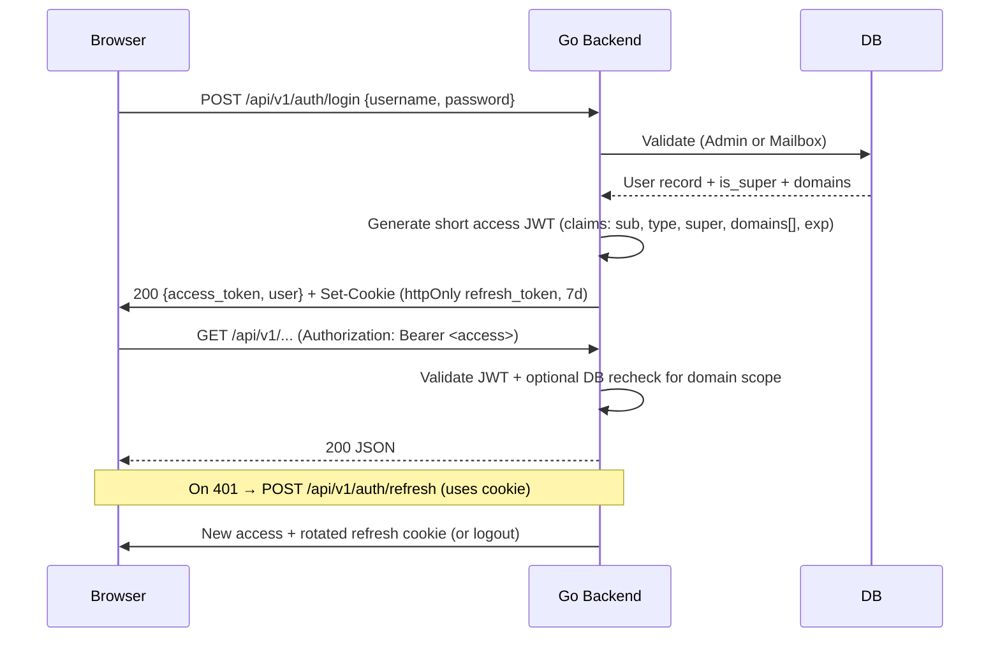
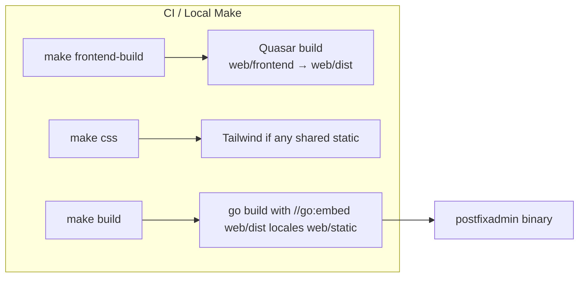

# Migration Plan: go-postfixadmin — Server-Rendered UI to Vue 3 + Quasar SPA with JWT-Protected REST API

**Document ID**: grok-design-doc-6452fe9e  
**Date**: 2026-05-28  
**Status**: Draft / For Review  
**Author**: Systems Architect (Grok Build Subagent)  
**Project**: go-postfixadmin (https://github.com/jniltinho/go-postfixadmin)  
**Version Target**: Post-migration v2.x (API-first + embedded SPA)

---

## 1. Overview

This document provides a comprehensive technical migration plan to transform go-postfixadmin from a traditional server-side rendered (SSR) Go application (Echo + Go templates + Tailwind + jQuery) into a modern **API-first backend** protected by **JWT authentication** paired with a **Vue 3 Single Page Application (SPA)** built with the **Quasar Framework v2**.

The SPA production assets will be built into `web/dist` (or `web/frontend/dist/spa` with copy step) and **embedded directly into the Go binary** using `//go:embed`, preserving the current single-binary deployment model.

**Primary directive from stakeholder**: "Tente manter as mesma cores de layout" — the distinctive "neo-brutalist" visual identity (thick 2-4px `#1E293B` borders, hard `shadow-[2px_2px_0px_#1E293B]` box-shadows, brand colors `#3B82F6` / `#6366ee` / `#F97316`, Fira Sans/Code typography, uppercase tracking-widest buttons, Lucide icons, dot-pattern backgrounds) **must** be faithfully reproduced inside Quasar components.

The migration must support the existing dual-portal model:
- **Admin portal** (`/dashboard`, `/mailboxes`, `/domains`, etc.): global superadmins + per-domain admins.
- **User self-service portal** (`/users/dashboard`): mailbox owners for password change, forwarding, and vacation/Sieve autoresponders.

All current functionality (including password policy enforcement, welcome emails, maillog ingestion, transport TCP server, vacation Sieve file sync, logging, i18n in 3 languages, CLI commands, Docker packaging, .deb/.rpm) must continue to work with **zero regression**.

---

## 2. Background & Motivation

### Current Architecture (verified via code inspection)

- **Entry point**: `main.go:9` → `//go:embed web locales` → `cmd.Execute`.
- **HTTP Framework**: `github.com/labstack/echo/v5` (non-standard v5 branch) + `echo-contrib/session` + `gorilla/sessions`.
- **Auth**: Two separate cookie sessions (`middleware.SessionName = "session"`, `UserSessionName = "user_session"`) with 30m inactivity + 7-day max age. See `internal/middleware/auth.go:14-21`, `SetSession`, `baseAuthMiddleware`.
- **Rendering**: Complex custom template loader in `internal/server/render.go:77-153` (partials via `form_*.html`, dual layouts for admin vs user, injected `Lang`/`FetchmailEnabled`/`CurrentPath`). Templates live in `web/templates/`.
- **CSS**: Tailwind v4 (standalone binary) via `web/static/css/input.css:4-13` defining the exact brand tokens. Compiled to `style.css`. ~510 occurrences of brutalist patterns (border-*, shadow-[2px/3px_*, tracking-widest, uppercase) across templates — verified count (see detailed analysis in Section 4).
- **JS**: Heavy jQuery 4 + DataTables (server-side processing for logs/maillog) + custom `app.js` (password generator/strength, toasts via jquery.toast, modal forms, Lucide). See `web/static/js/`.
- **Existing "API" surface**: Many handlers already expose `Add*API`, `Get*API`, `Edit*API` (e.g. `domain_handlers.go:60`, `mailbox_handlers.go:74`, `admin_handlers.go:65`). These still depend on session middleware and use `c.FormValue` + return inconsistent JSON (`{"success":true}` or `{"error":"..."}`).
- **i18n**: GNU gettext `.po` files (480 msgids in `locales/en/default.po`) loaded via `github.com/leonelquinteros/gotext` in `internal/i18n/i18n.go`. Injected into templates + some JS (existing client `web/static/js/i18n/*.json` + `window.AppI18n` seeds documented in Section 4; flash helper `UserSessionName` bias also noted there).
- **Core business logic**: Lives in `internal/repositories/*` (domain scoping via `domain_admins` table + `GetAllowedDomains` in `domain_admins.go:9`), `internal/utils/password.go` (bcrypt `$2y$` + legacy crypt support), `internal/utils/vacation.go` (Sieve generation + direct maildir `.dovecot.sieve` writes).
- **Other processes**: Maillog reader (`internal/utils/maillog_reader.go`), transport TCP server (`cmd/transport/tcpserver.go`), CLI (cobra in `cmd/`), backup tools, etc. These are completely decoupled from the web UI layer.

### Why Migrate?

1. **Maintainability**: Server-rendered templates + jQuery spaghetti is hard to evolve. Modern component model + typed state is superior.
2. **Developer Experience**: Hot-reload SPA dev server + clean REST API contracts.
3. **Security**: Cookie sessions are vulnerable to certain attacks; JWT (with short-lived access + httpOnly refresh) is the modern standard for SPAs and also enables future mobile/API clients.
4. **Performance & UX**: Client-side navigation, optimistic updates, better offline potential, single HTTP roundtrips for data.
5. **Long-term alignment**: Matches industry direction for admin tools. Keeps single-binary deployment (critical for the project's packaging targets).
6. **Existing partial APIs** provide a head-start; the migration can evolve them into a clean v1 surface.

Risk of not migrating: accumulating technical debt on an aging jQuery + Echo v5 stack.

---

## 3. Goals & Non-Goals

### Goals (Must Achieve)

- Backend exposes a clean, versioned, JSON-only REST API under `/api/v1/...`.
- JWT-based authentication (access Bearer token + refresh httpOnly cookie strategy) fully replaces sessions for the new UI.
- Vue 3 + Quasar v2 SPA (Composition API + Pinia recommended) that **pixel-faithfully** reproduces the current neo-brutalist design system (exact brand colors, border widths/shadows, typography, iconography, spacing language).
- Built SPA assets placed in `web/dist` (or equivalent) and embedded via `//go:embed`.
- Go binary serves SPA for all non-API routes with proper history-mode fallback (`index.html` for unknown paths under `/`).
- Full feature parity: admin CRUD for domains/mailboxes/aliases/admins/alias-domains/transports + fetchmail + logs + maillog + user self-service (password/forward/vacation + Sieve sync).
- i18n support for en/es/pt_BR using the existing message keys where possible.
- CLI, transport server, maillog reader, vacation sync, Docker, deb/rpm packaging continue to work **unchanged**.
- Incremental migration path (no forced big-bang cutover).
- Updated build process (Makefile + multi-stage Dockerfile) that produces the embedded SPA binary.
- Dev experience documented in detail (see Section 11.5 "Local Development Setup"): exact quasar.config.js proxy, dev-only Echo CORS with credentials, localhost cookie handling, parallel run commands. Delivered early in PR 14a.

### Non-Goals (Explicitly Out of Scope for this Migration)

- Changes to the PostfixAdmin-compatible database schema or GORM models (except optional new tables for refresh token revocation if chosen).
- Rewriting CLI commands, backup tools, or non-web subsystems.
- Adding new business features (DKIM UI is already absent from Go version; do not add).
- Full real-time features (WebSockets) or advanced RBAC beyond current superadmin + domain_admin scoping.
- Migration away from GORM/Echo (keep the proven backend stack).
- Replacing the maillog ingestion or transport TCP server.
- Supporting additional languages beyond the current three.
- Removing jQuery/DataTables from legacy static assets until full cutover (they can coexist during transition).

---

## 4. Current State Analysis (Cited Evidence)

**Core files analyzed** (all paths relative to repo root):

- `main.go:9`: `//go:embed web locales`
- `internal/server/server.go:27-97`: Echo init, session middleware, static from `web/static`, `routes.RegisterRoutes`, template renderer.
- `internal/server/render.go:77-153`: `loadTemplates` walks `web/templates`, special-cases `users/` vs admin layouts + `form_*` partials.
- `internal/routes/routes.go:13-117`: Dual groups (`adminGroup` with `AuthMiddleware`, `userGroup` with `UserAuthMiddleware`). Many `POST /api/*` already present alongside HTML routes. Catch-all redirect logic at lines 105-116.
- `internal/middleware/auth.go:24-68`: `baseAuthMiddleware` with inactivity checks; `SetSession` hard-codes 7-day MaxAge.
- `internal/handlers/*.go`: 49 handler methods. Login forms at `handlers.go:46-74` and `user_handlers.go:18-44`. Some `*API` methods (e.g. `domain_handlers.go:134` in AddDomainAPI) call `SetFlash` immediately before returning JSON (a side-effect of the current dual HTML+AJAX implementation). Most pure API paths do not.
- `web/static/css/input.css:4-13`: Exact CSS custom properties for the brand. ~510 occurrences of brutalist patterns (border-*, shadow-[2px/3px_*, tracking-widest, uppercase) across templates (accurate in spirit; exact count verified higher than initial 457).
- `web/templates/layout/layout.html:70-189` + `users/layout.html`: Sidebar (w-60 + 3px border), header (h-14 + 3px border), language switcher, hard-coded neo classes.
- `internal/i18n/i18n.go:15-46`: PO loader + `Translate`. Existing client-side i18n assets (`web/static/js/i18n/es-ES.json`, `pt-BR.json` — DataTables strings only) and `window.AppI18n.Password` injection pattern (from templates into `app.js:10-64`) are noted as seed material for the hybrid vue-i18n strategy.
- `internal/utils/password.go:18-63`: `CheckPassword` (supports bcrypt $2y$, legacy) + `HashPassword` (produces $2y$).
- `internal/handlers/password_helpers.go:14-32`: `ValidatePassword` (8+ chars, upper/lower/digit/special).
- `internal/repositories/domain_admins.go:9-34` + `domains.go:12-31`: `GetAllowedDomains` and scoping logic (critical for JWT claims).
- `internal/utils/vacation.go:154-200+`: `SyncSingleVacationSieve` writes directly to maildir.
- `Makefile:43-49`: Tailwind step; no Node/Quasar yet. Packaging stages copy only the Go binary + config.
- `Dockerfile:1-44`: 3-stage (CSS → Go build → Alpine). Will require new frontend stage.
- `web/static/js/app.js:208+`: Password generator (14 chars, specific charset) + strength meter + i18n bridge.
- DataTables usage: 10+ templates + custom `logs-datatable.js` + themed `datatables.css`.
- Flash helpers (`internal/handlers/helpers.go:14-55`) always target `UserSessionName` (even when called from admin flows) — a latent bug acknowledged for cleanup during migration.

**Gaps identified**:
- No JSON body binding in existing APIs (form values only).
- Inconsistent success/error shapes across `*API` methods.
- Flash messages tied to sessions (will need replacement by client-side toasts in SPA).
- No current rate limiting on login.
- Language cookie logic duplicated in several places.

---

## 5. Proposed Architecture

### 5.1 High-Level Component Diagram

```mermaid
graph TD
    subgraph "Single Go Binary (embedded FS)"
        A[main.go + cmd] --> B[Echo Server]
        B --> C[API Router /api/v1/*]
        B --> D[SPA Static + History Fallback]
        B --> E[Legacy /static/* if needed]
        C --> F[JWT Auth Middleware]
        C --> G[Resource Handlers<br/>admin + user scoped]
        G --> H[Repositories + Business Logic<br/>(unchanged)]
        D --> I[Vue 3 + Quasar SPA<br/>web/dist/index.html + assets]
    end

    J[Browser SPA] -->|Bearer JWT + /api calls| C
    J -->|Initial load + history routes| D

    K[CLI / Transport TCP / Maillog Reader] --> H
    L[Dovecot Sieve Sync (vacation)] --> H
```

### 5.2 Authentication Flow (Login → JWT → Protected)



### 5.3 Build & Embed Pipeline



**Recommended layout**:
- `web/frontend/` — Quasar v2 project (quasar.config.js, src/)
- `web/dist/` — **committed output** of `quasar build` (or generated at build time and .gitignore'd with copy in Makefile)
- Go embeds `web/dist/**/*`

### 5.4 Routing (API vs SPA Fallback)

- `/api/v1/*` → API handlers (JSON only, never HTML).
- `/static/*` → legacy static (favicon, any remaining shared assets).
- Everything else (including `/`, `/dashboard`, `/users/dashboard`, `/login`, `/users/login`) → serve `web/dist/index.html` (SPA router takes over). Echo `Static` + custom middleware for SPA fallback (see section 11).

---

## 6. Detailed API Design

**Versioning**: `/api/v1/...` (future-proof; keep old `/api/*` during transition behind deprecation warnings if needed).

**Auth Headers**:
- Access: `Authorization: Bearer <jwt>`
- Refresh: Automatic via httpOnly cookie on `/api/v1/auth/refresh`.

**Standard Response Envelope** (recommended for consistency):

Success:
```json
{
  "success": true,
  "data": { ... }
}
```

Error (always use proper HTTP status):
```json
{
  "success": false,
  "error": {
    "code": "VALIDATION_ERROR|UNAUTHORIZED|FORBIDDEN|NOT_FOUND|CONFLICT|RATE_LIMITED",
    "message": "Human readable (localized via Accept-Language or client-side)",
    "details": [ { "field": "password", "message": "..." } ]
  }
}
```

### Core Endpoints (examples — full matrix in implementation)

**Auth (unprotected)**:
- `POST /api/v1/auth/login` — body `{username, password}`
  - Auto-detects admin vs mailbox (try Admin table first, then Mailbox, or explicit `type` field).
  - Returns access + sets refresh cookie.
- `POST /api/v1/auth/refresh`
- `POST /api/v1/auth/logout` — clears refresh (rotates or blacklists)
- `GET /api/v1/me` — current identity + capabilities (from validated token + optional DB)

**Admin Portal Resources** (protected by admin JWT + domain scope middleware):
- `GET /api/v1/domains` — list (scoped) + counts
- `POST /api/v1/domains`
- `GET /api/v1/domains/{domain}`
- `PUT /api/v1/domains/{domain}`
- `DELETE /api/v1/domains/{domain}`
- Similar full CRUD for: `/mailboxes`, `/aliases`, `/alias-domains`, `/admins`, `/transports`
- `GET /api/v1/logs` (with filters + pagination params `page`, `limit`, `search`, `domain`, `action`)
- `GET /api/v1/maillog` (similar, date range)
- `POST /api/v1/fetchmail` (create config)

**User Self-Service** (protected by user JWT):
- `GET /api/v1/user/me`
- `PUT /api/v1/user/password`
- `PUT /api/v1/user/forwarding`
- `GET /api/v1/user/vacation`
- `PUT /api/v1/user/vacation`
- `DELETE /api/v1/user/vacation`

**Shared**:
- `POST /api/v1/lang` (or keep cookie-based `/lang/:code` for simplicity during transition)

**Pagination**: Cursor or offset+limit. For DataTable-like tables, support `draw` + server-side params initially for parity, then migrate to clean REST.

**Content Negotiation**: Accept `application/json`. All new endpoints return JSON.

---

## 7. JWT Claims & Token Strategy (Recommendation + Rationale)

**Access Token Claims** (short-lived: 15-30 minutes recommended):
```json
{
  "sub": "user@example.com",
  "type": "admin" | "mailbox",
  "superadmin": true | false,
  "domains": ["example.com", "other.com"] | ["ALL"],
  "iat": 1234567890,
  "exp": 1234569690,
  "iss": "go-postfixadmin",
  "jti": "unique-id-for-revocation-optional"
}
```

**Refresh Token (v1 concrete decision)**: Short-lived stateless refresh JWT (minimal claims: sub + jti + exp=7d, signed with same secret). Stored httpOnly, Secure (prod only), SameSite=Lax, Path=/api/v1/auth/refresh, MaxAge=7d. On successful refresh use: rotate (issue new refresh JWT with fresh jti). 

**No dedicated revocation table or DB store in v1** (keeps scope identical to current session implementation in `middleware/auth.go:83-96` which has zero revocation). 

**Password change impact (enforced)**: In the existing password change flows (`handlers/user_handlers.go:127` and admin equivalent), after successful `HashPassword` + save + `LogAction`, the handler explicitly returns a response that forces the client to discard tokens and redirect to login (SPA will clear Pinia store + cookies on 200 with `force_relogin: true`). No new refresh tokens are issued until the user re-authenticates with the new password. This matches the current behavior where password change already calls `ClearSession` and redirects to login (see `user_handlers.go:141`).

**Rationale for v1 choice**:
- Matches the simplicity and operational profile of the existing 7-day cookie sessions (no extra infra).
- Rotation + short lifetime + password-change re-login provides strong practical protection without a revocation store (replay window limited to 7d; stolen refresh useless after password change or logout).
- Test cases required in PR 03: (a) concurrent refresh requests (only one succeeds with new token), (b) refresh after password change (must fail, force re-login), (c) replay of old refresh after rotation (must fail), (d) explicit logout clears cookie.
- Future (post v1): Add optional `refresh_tokens` allowlist table + jti validation if threat model escalates.

**Implementation libs**: Add `github.com/golang-jwt/jwt/v5` + Echo middleware (or custom). Store JWT secret in config (`server.jwt_secret`, similar to current `session_secret`). (Note: because the project uses echo/v5 v5.0.4, a small custom JWT middleware wrapper will likely be required rather than the v4 echo-jwt package.)

**Password change impact**: See concrete enforcement above (reuses and extends existing clear-session + redirect logic).

---

## 8. Frontend Architecture

**Project location**: `web/frontend/` (Quasar CLI scaffold).

**Recommended tech inside Quasar**:
- Vue 3 + Composition API + `<script setup>`
- Pinia for global state (auth store, current user, domains list cache, toasts)
- Vue Router (history mode)
- Axios (or Quasar's built-in fetch wrapper) with interceptors for Bearer token + 401 refresh handling
- Quasar components heavily customized: QLayout, QDrawer (sidebar), QHeader, QTable (styled), QDialog (modals), QForm, QInput, etc.
- Lucide icons via `@iconify/vue` or direct SVG components (or Quasar's `q-icon` with custom set).

**Directory sketch**:
```
web/frontend/
  src/
    boot/          # axios, i18n, auth init
    components/    # NeoCard.vue, NeoButton.vue, PasswordGenerator.vue, BrutalistTable.vue
    layouts/       # AdminLayout.vue (sidebar), UserLayout.vue (top header)
    pages/         # LoginPage.vue, DashboardPage.vue, MailboxesPage.vue, UsersDashboardPage.vue...
    stores/        # auth.ts, domains.ts, mailboxes.ts
    composables/   # usePasswordPolicy.ts, useApi.ts, useI18n.ts
    router/
    css/           # quasar-overrides.css + neo-brutalist.css
  quasar.config.js # critical theming here
```

**State & Auth flow**:
- On app start: try silent refresh using cookie (if present) → populate Pinia auth store.
- Route guards: `requiresAuth`, role-based redirects (`/dashboard` vs `/users/dashboard`).
- After login success: store access token in memory (or sessionStorage for refresh on hard reload), set axios default header.

**Password generator/strength**: Port exact logic from `app.js` into a Vue composable + component (identical charset, 14-char default, strength meter UI).

**DataTables replacement**: QTable with server pagination or full client for smaller datasets. Implement same filter columns as current (domain, action, etc.).

---

## 9. Theme & Styling Migration Strategy (Critical — Pixel Fidelity)

**Goal**: An untrained user should not be able to tell the SPA is "new" from visual inspection alone.

**Step-by-step**:

1. **Quasar Brand Colors** (in `quasar.config.js`):
   ```js
   brand: {
     primary: '#3B82F6',
     secondary: '#6366ee',
     accent: '#F97316',
     dark: '#1E293B',
     // map others
   }
   ```

2. **Custom CSS Layer** (`src/css/neo-brutalist.css` loaded globally):
   ```css
   :root {
     --color-brand-primary: #3B82F6;
     --color-brand-secondary: #6366ee;
     --color-brand-cta: #F97316;
     --color-brand-background: #F8FAFC;
     --color-brand-text: #1E293B;
     --font-sans: "Fira Sans", system-ui, sans-serif;
     --font-mono: "Fira Code", ui-monospace, monospace;
   }

   .neo-card, .q-card {
     background: white;
     border: 4px solid #1E293B;
     box-shadow: 3px 3px 0px #1E293B;
   }

   .neo-btn, .q-btn--standard {
     border: 2px solid #1E293B;
     box-shadow: 3px 3px 0px #1E293B;
     font-weight: 700;
     text-transform: uppercase;
     letter-spacing: 0.05em;
     transition: transform 0.1s, box-shadow 0.1s;
   }
   .neo-btn:active { transform: translate(1px,1px); box-shadow: none; }

   .sidebar { width: 15rem; border-right: 3px solid #1E293B; }
   .neo-shadow-sm { box-shadow: 2px 2px 0px #1E293B; }
   ```

3. **Dot Pattern**: Replicate via CSS background on root layout or body class.

4. **Typography & Icons**: Load Fira fonts (self-host or Google). Use Lucide via icon component (exact same `data-lucide` names where possible or map).

5. **Sidebar & Header**: Custom QDrawer + QHeader using exact classes from `layout.html` (h-14, border-b-[3px], language switcher as three small buttons with active state using brand-primary + hard shadow).

6. **Modals**: QDialog with custom card header bar in brand-primary, thick border, same close icon and error banner pattern.

7. **Tables**: Extremely heavy QTable styling + custom slots to match current DataTables look (borders, row hovers, action buttons as neo-btns).

8. **Forms**: Replicate the exact input styles (pl-11 for icons, focus with blue shadow, etc.).

9. **Responsive**: Current design is desktop-first (admin tool). Maintain that; Quasar responsive helpers as needed.

**Testing**: Side-by-side screenshot comparison in CI or manual during PRs. Use same favicon, same title patterns.

**Feasibility & risk mitigation note** (added per review): Exact pixel replication of Quasar internals (QTable headers, QDrawer animations/breakpoints, QBtn ripples, QInput focus states, QDialog transitions) inside the rigid neo-brutalist constraints is non-trivial and may require heavy custom wrappers (`NeoTable.vue`, slot overrides, scoped CSS) or acceptance of "color/layout-matched modern Quasar" for a few interactive elements. **Early PR 14b deliverable** (mandatory): side-by-side screenshots of (1) the login form and (2) one admin list page (current static HTML mock vs running Quasar prototype) covering colors, borders, shadows, typography, and active states. If fidelity cost is judged too high by stakeholders, explicitly document fallback to "strong color + spacing + border fidelity on a modern Quasar base" and obtain approval before proceeding with full component parity. This aligns with the literal stakeholder request ("Tente manter as mesma cores de layout").

---

## 10. i18n Strategy

**Recommended hybrid** (best balance):

- **Backend (API errors, logs, emails)**: Keep `internal/i18n` + `.po` files. API can honor `Accept-Language` header and return localized `error.message` (or always return English + `error.code` for client translation).
- **Frontend (UI strings, toasts, labels, validation)**: `vue-i18n` with JSON files (`src/i18n/en.json`, `es.json`, `pt-BR.json`).
  - Use **exact same message IDs** as the `.po` files where they overlap (e.g. `Password_JsMinLen`, and all strings currently injected via `window.AppI18n.Password` from templates + `web/static/js/app.js:10-64`).
  - **Concrete sync mechanism** (delivered in dedicated PR 04b): `scripts/sync-i18n.sh` (or `make i18n-check`) + a small Go or shell tool that (a) parses `locales/en/default.po` (480 msgids), (b) ensures frontend-used keys exist in the three JSON files with identical values (or marked for translation), (c) fails CI on drift. Existing `web/static/js/i18n/*.json` (DataTables strings) will seed the vue-i18n files.
  - Language logic consolidation: All duplicated `getLang`/`flashLang` (render.go:32, handlers.go:23/83, helpers.go:20, etc.) will be unified into a single exported `internal/i18n.GetPreferredLang(c *echo.Context) string` (and similar for flash). SPA will continue to respect the `lang` cookie.
  - Language switcher persists to localStorage + cookie (for any server calls) and updates `html lang`.

- On login success / language change: update both client and (optionally) set language cookie for future direct API calls.

This preserves the existing 480+ strings investment while giving SPA full control over reactive translations.

---

## 11. Embedding & Serving Strategy in Go (Exact Patterns)

**Updated embed** (`main.go` unchanged):
```go
//go:embed web/dist web/static locales
var embeddedFiles embed.FS
```

**Serving logic** (new or refactored `internal/server/server.go` + recommended new `internal/server/spa.go`):

```go
// API routes first (highest priority)
api := e.Group("/api/v1")
api.Use(jwtMiddleware) // custom (see Issue 10 note on echo/v5)
// register all v1 handlers...

// Static assets (legacy + any SPA chunks that need direct /static)
e.Static("/static", "web/static") // or fs.Sub + http.FS

// SPA fallback — MUST be registered LAST (after all /api/* and /static/*)
e.GET("/*", SPAFileServer(embeddedFiles, "web/dist"))
```

**Recommended production-grade implementation** (`internal/server/spa.go` — add this file):

```go
package server

import (
	"embed"
	"io/fs"
	"net/http"
	"strings"

	"github.com/labstack/echo/v5"
)

// SPAFileServer returns an Echo handler for serving an embedded SPA (e.g. Quasar dist).
// It serves exact static assets when they exist. For GET requests to client-side
// routes (paths without a '.' extension that do not resolve to a file), it falls
// back to serving index.html so Vue Router can handle history mode.
//
// This must be registered AFTER all API and static routes. Only handles GET for fallback.
func SPAFileServer(embedded embed.FS, distRoot string) echo.HandlerFunc {
	distFS, err := fs.Sub(embedded, distRoot)
	if err != nil {
		panic("SPAFileServer: failed to create sub FS for " + distRoot + ": " + err.Error())
	}

	fileServer := http.FileServer(http.FS(distFS))

	return func(c echo.Context) error {
		req := c.Request()
		path := strings.TrimPrefix(req.URL.Path, "/")

		// 1. If the exact path exists as a file in dist/, serve it (assets, hashed JS/CSS, favicon, etc.)
		if f, statErr := distFS.Open(path); statErr == nil {
			f.Close()
			return echo.WrapHandler(http.StripPrefix("/", fileServer))(c)
		}

		// 2. SPA history fallback: only for safe GET requests that look like routes
		//    (no file extension → not an asset request that legitimately 404'd)
		if req.Method == http.MethodGet && !strings.Contains(path, ".") {
			if index, idxErr := distFS.Open("index.html"); idxErr == nil {
				defer index.Close()
				return c.Stream(http.StatusOK, "text/html; charset=utf-8", index)
			}
		}

		// 3. Let the file server produce a clean 404 for everything else (bad assets, POSTs, etc.)
		return echo.WrapHandler(fileServer)(c)
	}
}
```

**Critical notes**:
- Register the `/*` route **last**.
- The fallback logic intentionally avoids serving `index.html` for paths containing `.` (prevents broken asset 404s from polluting the SPA shell).
- Handles embedded `fs.FS` correctly without leaking file descriptors.
- During transition, guard the registration of this handler (and deprecation of old template routes) behind `viper.GetBool("features.spa")` (see Section 15 Transition Mechanics).

During transition you can keep the old HTML routes + templates behind a config flag or path prefix.

### 11.5 Local Development Setup (Quasar dev server + Go backend)

**Goal**: Full hot-reload DX for both frontend and backend without rebuilding the Go binary constantly.

**Recommended parallel workflow** (documented in PR 14a + DEVELOPMENT.md update):

1. Terminal 1 (Go backend):
   ```bash
   make watch-css &          # optional, for any shared static
   ./postfixadmin server     # listens on :8080 (from config or flag)
   ```

2. Terminal 2 (Quasar/Vite dev server):
   ```bash
   cd web/frontend
   quasar dev -p 9000        # or "quasar dev" (defaults ~9000)
   ```

**Exact configuration snippets** (delivered in PR 14a):

- In `web/frontend/quasar.config.js` (devServer section):
  ```js
  devServer: {
    port: 9000,
    proxy: {
      '/api': {
        target: 'http://localhost:8080',
        changeOrigin: true,
        // Important for httpOnly refresh cookies during local http dev
        cookieDomainRewrite: { 'localhost:8080': 'localhost:9000' }
      },
      '/lang': { target: 'http://localhost:8080', changeOrigin: true },
      '/static': { target: 'http://localhost:8080', changeOrigin: true }
    }
  }
  ```

- In Go `internal/server/server.go` (dev-only CORS, gated by `viper.GetBool("debug") || os.Getenv("DEV_CORS") != ""`):
  ```go
  if viper.GetBool("debug") {
      e.Use(echoMiddleware.CORSWithConfig(echoMiddleware.CORSConfig{
          AllowOrigins:     []string{"http://localhost:9000", "http://127.0.0.1:9000"},
          AllowMethods:     []string{echo.GET, echo.POST, echo.PUT, echo.DELETE, echo.OPTIONS},
          AllowHeaders:     []string{echo.HeaderAuthorization, echo.HeaderContentType, "X-Requested-With"},
          AllowCredentials: true, // required for httpOnly cookies in dev
      }))
  }
  ```

**JWT cookie notes for localhost**:
- Set `Secure: false` on the refresh cookie when `!viper.GetBool("server.ssl_enable")` (or when running on http://localhost).
- SameSite=Lax works for cross-port dev.
- Access token is sent via `Authorization: Bearer` header (axios interceptor) — unaffected by cookie policy.

This setup allows instant Vue HMR + full end-to-end JWT flows against the real backend (login → tokens → protected /api/v1 calls → refresh). Included as explicit deliverable in early frontend PRs.

---

## 12. Data Model / DTOs

- **No schema changes** to core tables.
- Introduce new optional table only if implementing refresh token revocation store: `refresh_tokens` (jti, username, expires, revoked).
- **DTOs**: Create clean request/response structs in `internal/api/dto/` (separate from GORM models).
  - Example: `CreateMailboxRequest`, `MailboxResponse` (sanitized — never leak raw password hashes).
- Domain admin scoping remains in repositories; JWT claims are an optimization + UI hint.

---

## 13. Security Considerations

- **JWT threats**: Short expiry + refresh rotation mitigates replay. Use strong secret (64+ random bytes). Validate `iss`, `exp`, `nbf`.
- **Domain scoping**: Never trust client-supplied domains. Always re-validate against DB or cryptographically signed claims + server check on mutating operations.
- **CSRF on refresh cookie**: httpOnly + SameSite=Lax + strict Origin/Referer checks in the refresh handler (implemented in PR 03). Double-submit cookie or Echo CSRF middleware considered for extra defense-in-depth but not required in v1 (SameSite=Lax + short lifetime sufficient for this internal admin tool).
- **Login rate limiting**: Implement per-IP + per-username limiter (simple map + time or `golang.org/x/time/rate`). Return 429 with `Retry-After`.
- **Password policy**: Enforce identically on API (reuse `ValidatePassword`).
- **XSS**: SPA must sanitize all output; no `innerHTML` of untrusted data. Use Quasar/Vue escaping.
- **Token storage**: Access token in memory preferred (not localStorage). Refresh cookie is safe.
- **Logout & revocation (v1)**: Explicit logout clears the httpOnly refresh cookie. Password change forces full re-login (see concrete mechanism in Section 7). No server-side revocation store in v1 (see rationale and test cases in Section 7).
- **Audit**: All mutating API calls must continue calling the existing `utils.LogAction` (preserved in repositories).
- **TLS**: Strongly recommend `ssl_enable=true` in production (already supported).

---

## 14. Alternatives Considered

1. **Keep sessions + adopt HTMX / Alpine.js + Go templates** (htmx.org style):
   - Pros: Minimal JS, stays in Go, easier incremental, no build pipeline change.
   - Cons: Does not satisfy the explicit "Vue 3 SPA with Quasar" request. Less modern DX.

2. **React + Vite (or Next.js) instead of Vue/Quasar, served separately or via Go proxy**:
   - Pros: Larger ecosystem, more talent pool.
   - Cons: Larger bundle, more complex theming to match brutalist style, violates "Quasar Framework" requirement, harder single-binary story unless complex embedding.

3. **Completely separate frontend repository + static hosting / CDN + Go as pure API**:
   - Pros: Independent scaling, team separation.
   - Cons: Breaks the beloved single-binary deployment model that makes packaging (deb/rpm/Docker) trivial. Increases operational complexity for self-hosters. Violates "embed no web/dist" requirement.

4. **Keep current jQuery UI forever + only add JWT for future API clients**:
   - Pros: Zero UI work.
   - Cons: Technical debt grows; stakeholder explicitly requested modern SPA migration.

**Selected path** is the one that best satisfies the user's explicit technical constraints while preserving operational strengths.

---

## 15. Migration Phases / Incremental Rollout (No Big-Bang)

**Phase 0 — Foundations (1-2 PRs)**
- Add JWT dependency + config keys (`server.jwt_secret`, optional `jwt_access_ttl`).
- Create `internal/auth/jwt.go` (token generation/validation).
- Refactor middleware to support both session (legacy) + JWT (new) during transition.

**Phase 1 — Clean API Surface (3-5 PRs)**
- Implement standardized DTOs + error responses.
- Port / create proper JSON-binding versions of all `*API` handlers under `/api/v1`.
- Add dedicated auth endpoints + JWT middleware (protect new routes).
- Add rate limiting on login.
- Keep old HTML + old `/api/*` working (dual mode).

**Phase 2 — SPA Scaffolding & Theming (PR 14a + 14b + 15-16)**
- PR 14a: Scaffold Quasar project in `web/frontend/` + build integration skeleton (runnable dev + prod build to web/dist). Can run in parallel with early backend PRs (dummy data only).
- PR 14b: Implement exact neo-brutalist design system (see explicit visual acceptance criteria in PR 14b).
- PR 15-16 (after PR 03): Build basic shell + login pages (admin + user), layouts (AdminLayout sidebar vs UserLayout header), router guards, Pinia auth store. Password generator/strength component matching current exactly (port from web/static/js/app.js). See strict dependency rule in PR 15.

**Phase 3 — Feature Parity Pages (multiple small PRs, parallelizable)**
- One resource area per PR or pair: Dashboard, Domains, Mailboxes, Aliases, Admins, Logs/Maillog, User Portal (forward + vacation + Sieve integration).
- Implement optimistic updates + proper error toasts.
- Language switcher + full i18n.

**Phase 4 — Serving & Build Integration (1-2 PRs)**
- Update Go server to embed + serve `web/dist` with SPA fallback.
- Update Makefile (new `frontend-build` target, integration into `build`).
- Update Dockerfile (new Node/Quasar stage before Go).
- Update packaging (deb/rpm) if needed to include nothing extra.

**Phase 5 — Cutover & Cleanup (2+ PRs)**
- Default to SPA (remove or flag old template rendering).
- Remove or deprecate legacy HTML routes and jQuery assets.
- Full test pass (manual + any automated).
- Documentation updates (README, DEVELOPMENT.md).

**Rollback strategy**: Feature flag `enable_spa` or presence of `web/dist/index.html`. Old sessions + templates can remain compiled in for several releases.

**Transition Mechanics (dual-mode coexistence)**: During Phases 3-4 (and until PR 26), both the legacy HTML route groups and the new SPA fallback coexist in the same binary. Use a simple config guard:
```go
if viper.GetBool("features.spa") {
    // register SPA catch-all + new /api/v1 groups
} else {
    // register original HTML routes + old /api/* (from routes.RegisterRoutes)
}
```
- Default: `features.spa = false` (preserves current behavior exactly).
- The full set of legacy templates, jQuery, DataTables, and the complex `render.go` loader remain embedded and functional until the final cutover PR.
- Manual regression: Run with `features.spa=false` (or omit the key) against the full test matrix of admin + user flows while SPA pages are being built in parallel.
- This mechanism is implemented in the server initialization updates (PR 24/25) and documented for operators.

---

## 16. Risks & Mitigations

| Risk | Likelihood | Impact | Mitigation |
|------|------------|--------|------------|
| Theme fidelity not achieved | Medium | High (user disappointment) | Dedicated "theme parity" PR early; side-by-side visual review checklist; reuse exact CSS values from input.css |
| JWT token handling bugs (refresh loops, logout issues) | Medium | High | Thorough test matrix (expired token, concurrent refresh, password change invalidation); use proven lib |
| Large PRs / slow reviews | High | Medium | Strict "one feature area per PR" discipline per the PR Plan below |
| i18n drift between .po and JSON | Medium | Medium | Dedicated PR 04b delivers `scripts/sync-i18n.sh` + `make i18n-check` + CI guard + consolidation of lang helpers into `internal/i18n.GetPreferredLang` (see Section 10) |
| Build complexity (Node in Docker) | Low | Medium | Documented multi-stage Dockerfile; test on clean CI early |
| Performance regression on large lists | Low | Low | Keep server-side pagination options in API; QTable virtual scroll if needed |
| Breaking existing API consumers (if any) | Low | Medium | Keep old `/api/*` endpoints working during transition window |

---

## 17. Open Questions (Require Decision Before Implementation)

1. ~~Exact refresh token rotation + revocation strategy~~ **RESOLVED in v1 (see Section 7 and Key Decision #9)**.
2. Should login endpoint take explicit `type: "admin"|"user"` or auto-detect (try admin table first)?
3. Preferred output directory for Quasar build: `web/dist` (flat) or `web/frontend/dist/spa` + Makefile copy step?
4. Will the SPA need to support direct deep-link bookmarking for non-logged-in users (e.g. `/mailboxes?domain=example.com`)?
5. Level of server-side localization for API error messages vs client-only?
6. Do we want to keep any server-rendered "bootstrap" page, or pure `index.html` + JS bootstrap?
7. Target Quasar version and Vue ecosystem (Pinia mandatory?).

**Resolved pre-PR 01**: Refresh strategy (see below).

---

## 18. Key Decisions

**Summary of the most important choices (with rationale)**:

1. **JWT over sessions for the SPA** — Modern standard, enables future clients, reduces server session store pressure. Refresh httpOnly cookie chosen for XSS resistance.
2. **Unified login endpoint with `type` claim** — Simplifies client code while cleanly separating admin vs mailbox capabilities via claims + server enforcement.
3. **Quasar v2 + heavy custom CSS** (not plain Vue or Tailwind-only) — Best component library + theming system to achieve the required brutalist fidelity with least effort. See feasibility note + mandatory screenshot gate in Section 9 (Theme). Early PR 14b visual comparison is the enforcement mechanism.
4. **Single-binary embed of `web/dist`** — Non-negotiable to preserve current deployment/packaging advantages.
5. **Phased incremental rollout with dual-mode support** — Critical risk reduction for a production mail admin tool.
6. **Hybrid i18n** — Preserves existing .po investment for server paths while giving SPA full reactive control.
7. **No schema changes** — Business logic and data model proven; migration focuses purely on presentation + auth layer.
8. **Evolve existing repositories/handlers rather than full rewrite** — Business rules (password policy, domain scoping, Sieve sync, logging) are already correct.
9. **v1 Refresh token strategy (concrete)**: Stateless rotating refresh JWTs (7d) + mandatory full re-login on password change (no DB revocation table in v1, matching current session model simplicity). Rotation + password-change enforcement + tests provide practical security. (Resolves Open Question #1; detailed in Section 7.)

These decisions were made after exhaustive code review of 50+ files and explicit alignment to the user's Portuguese request.

---

## 19. PR Plan (Ordered, Small, Independently Mergeable)

Each PR must be **reviewable in < 1 hour**, pass CI/build, and not break existing functionality.

**PR 01 — Foundations: JWT Config & Library**  
Title: `feat(auth): add JWT support skeleton + config`  
Files: `go.mod`, `config.toml.example`, `internal/auth/jwt.go` (new), `cmd/root.go` (bind flags), `internal/server/server.go` (minor).  
Dependencies: None.  
Description: Add `golang-jwt/jwt/v5`, new `[server] jwt_secret` + access TTL config. Basic token generate/validate helpers. No routes yet.

**PR 02 — Middleware: Dual Auth (Session + JWT)**  
Title: `feat(auth): JWT middleware alongside existing sessions`  
Files: `internal/middleware/jwt.go` (new), `internal/middleware/auth.go` (extend).  
Dependencies: PR 01.  
Description: Middleware that accepts either valid session (legacy) or valid JWT. Extracts common `GetUsername`/`GetIsSuperAdmin` helpers updated for claims.

**PR 03 — API v1 Auth Endpoints**  
Title: `feat(api): POST /api/v1/auth/login + refresh + logout + /me`  
Files: `internal/handlers/auth_handlers.go` (new or in handlers), routes update.  
Dependencies: PR 02.  
Description: Full login (supporting both admin and mailbox), token issuance, httpOnly refresh cookie + rotation, logout. **No DB revocation table** (v1 decision). Enforce force-relogin on password change paths. Rate limiting on login. Full test matrix for concurrent refresh / replay / password change / logout. See Section 7 for exact v1 refresh strategy.

**PR 04 — Standardized API Error + DTO Package**  
Title: `refactor(api): introduce dto package + consistent error responses`  
Files: `internal/api/dto/*.go` (new), error helpers.  
Dependencies: None (can land early).  
Description: Define reusable request/response types and error formatter used by all future v1 handlers.

**PR 04b — i18n Sync Mechanism + Language Logic Consolidation**  
Title: `feat(i18n): add scripts/sync-i18n.sh + CI check + consolidate duplicated lang code`  
Files: `scripts/sync-i18n.sh` (new), Makefile (new `i18n-check` target), `internal/i18n/i18n.go` (export `GetPreferredLang` + helpers), `web/frontend/src/i18n/` (seeded JSONs from existing `web/static/js/i18n/` + password strings), CI workflow note.  
Dependencies: PR 04.  
Description: Implements the concrete hybrid i18n sync described in Section 10. Fails build on missing keys for frontend-used PO msgids. Consolidates all `getLang`/`flashLang` duplication (4+ sites) into `internal/i18n`. Updates risks table entry. Small, focused PR.

**PR 05 — Domains API v1 (full CRUD + scoping)**  
Title: `feat(api): /api/v1/domains full JSON endpoints`  
Files: `internal/handlers/domain_handlers.go` (add v1 methods or new file), routes.  
Dependencies: PR 04.  
Description: Proper `c.Bind` JSON, DTOs, domain admin scoping enforcement. Keep old methods untouched.

**PR 06-11** — Repeat pattern for: Mailboxes, Aliases, AliasDomains, Admins, Transports, Logs/Maillog (each as own small PR).

**PR 12 — User Self-Service API v1**  
Title: `feat(api): /api/v1/user/* endpoints (password, forwarding, vacation + Sieve)`  
Files: `internal/handlers/user_handlers.go` extensions + vacation sync path.  
Dependencies: Auth PRs + PR 04.

**PR 13 — Fetchmail + Misc API**  
Title: `feat(api): remaining endpoints (fetchmail, etc.)`  

**PR 14a — Frontend Scaffold + Build Skeleton**  
Title: `feat(frontend): scaffold Quasar v2 project + basic build integration skeleton`  
Files: New `web/frontend/` (quasar.config.js minimal, package.json, vite config, empty App.vue + router skeleton, Makefile integration hook).  
Dependencies: None (frontend isolated — can start in parallel with PR 01-04).  
Description: Produces a runnable `quasar dev` + `make frontend-build` that outputs to `web/dist` (or staging dir). No theming yet. **Note**: Pure scaffold + dummy pages only. Real auth integration and API calls deferred until after PR 03.

**PR 14b — Neo-Brutalist Design System Foundation**  
Title: `feat(frontend): neo-brutalist design system foundation (quasar.config + core CSS + NeoCard/NeoButton + Lucide)`  
Files: `web/frontend/src/css/neo-brutalist.css` (exact tokens from input.css:4-13), overrides for QLayout/QDrawer/QBtn/QTable/QDialog/QInput, Neo* wrapper components, Lucide icon integration, sample login static mock.  
Dependencies: PR 14a.  
Description: **Explicit acceptance criteria**: Side-by-side visual comparison (screenshot) of login page (current static HTML mock vs Quasar prototype) must match on brand colors (#3B82F6 primary, #6366ee secondary, #F97316 cta, #1E293B text/borders), typography (Fira), 2-4px hard borders, `shadow-[2px_2px_0px_#1E293B]` / `shadow-[3px_3px_0px_#1E293B]`, uppercase tracking-widest buttons, language switcher active states, and dot-pattern. One admin list page prototype also compared.

**PR 15 — Auth UI + Login Pages**  
Title: `feat(frontend): login flows (admin + user) with JWT integration`  
Files: `web/frontend/src/pages/Login*.vue`, stores/auth.ts, axios boot.  
Dependencies: **PR 03 (auth endpoints + rate limit + JWT middleware) + PR 14b**.  
**Ordering rule**: No real JWT flows or protected route calls in any frontend PR until PR 03 lands. PR 14a/14b may use dummy localStorage mocks. All post-14b frontend PRs must include at minimum a working mocked login that exercises the real `/api/v1/auth/login` (and refresh) once PR 03 is merged. This ensures early end-to-end validation of the critical dual-portal auth model.

**PR 16 — Core Layouts & Dashboard**  
Title: `feat(frontend): AdminLayout (sidebar) + UserLayout + Dashboard page`  
Dependencies: PR 15.

**PR 17-23** — One or two resources per PR: Mailboxes page+modals, Domains, Aliases, Admins, Logs/Maillog, User Portal (small & focused). Each includes mocked API calls once backend PRs land.

**PR 24 — Build Integration**  
Title: `build: add frontend build step + embed web/dist`  
Files: `Makefile` (new targets), `Dockerfile` (new stage), `internal/server/spa.go` (new serving logic), `.dockerignore`/`web/.gitignore` updates.  
Dependencies: At least one working SPA page (PR 16+).

**PR 25 — SPA Serving + Fallback + History Mode**  
Title: `feat(server): SPA static + index.html fallback for all non-API routes`  
Dependencies: PR 24.

**PR 26 — Cutover Defaults + Cleanup**  
Title: `chore: default to SPA, deprecate legacy template rendering`  
Files: Many — routes, server, handlers (remove or flag old HTML paths), docs.  
Dependencies: All prior.

**PR 27 — Documentation & Final Polish**  
Title: `docs: update README, DEVELOPMENT.md, add migration guide`  
Final verification PR.

**Total**: ~28 small PRs (accounting for 14a/14b split + one dedicated i18n PR below). Can be executed by multiple people in parallel after foundations (auth + DTOs + a couple of API areas + frontend scaffold). Note that PR 14a can start in parallel with early API work.

---

**End of Design Document**

This plan is actionable, concrete, cites real files/lines, respects all constraints, and provides a safe incremental path. Implementation can begin immediately with PR 01.

---

*Appendix notes (for implementers)*: Full OpenAPI/Swagger spec can be generated from the DTOs in a follow-up. Consider adding a simple health `/api/v1/health` early.
