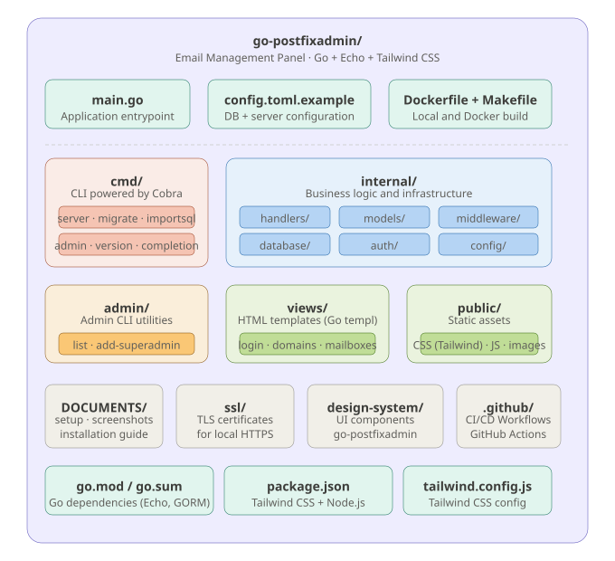
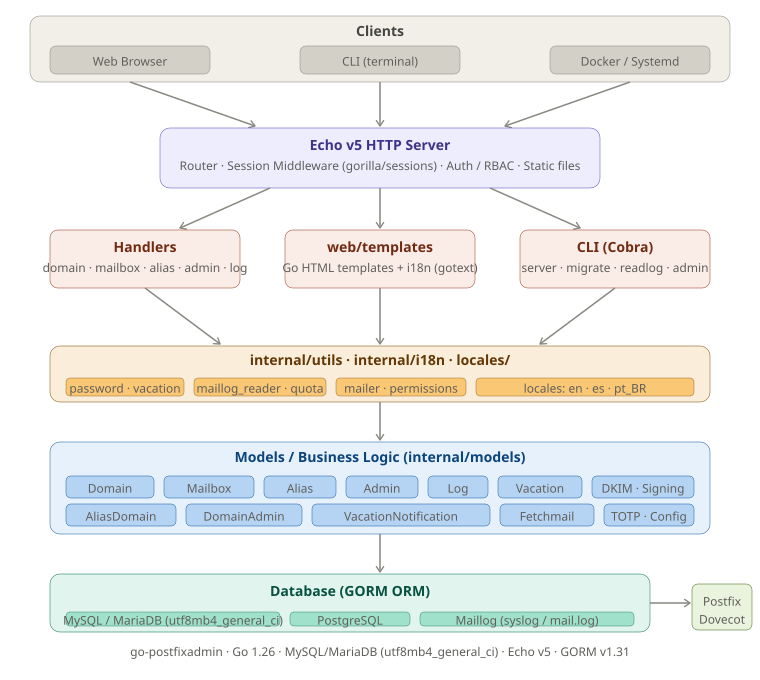

# go-postfixadmin — Project Diagrams

> Professional Email Administration System built with Go, Echo, and Tailwind CSS  
> Repository: [github.com/jniltinho/go-postfixadmin](https://github.com/jniltinho/go-postfixadmin)

---

## 1. Repository Structure

---

## 2. System Architecture

---

*Generated from [jniltinho/go-postfixadmin](https://github.com/jniltinho/go-postfixadmin) · v1.0.52*
