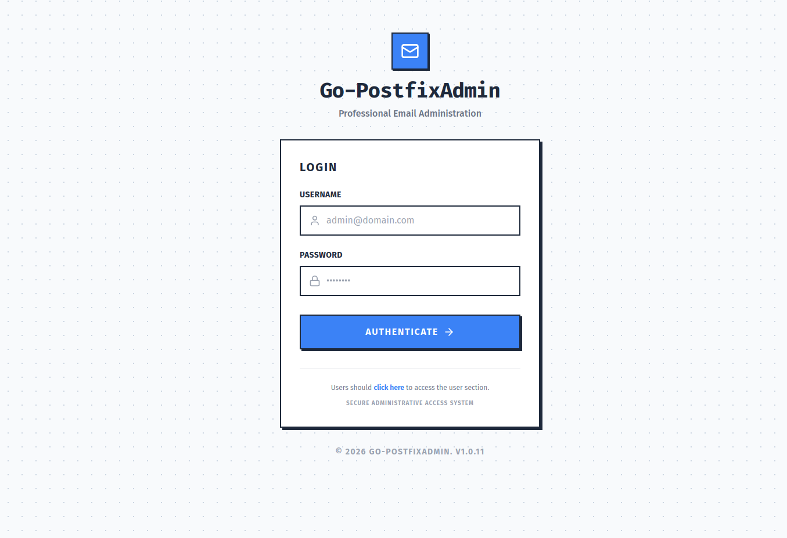

# Go-Postfixadmin

Professional Email Administration System built with Go, Echo, and Tailwind CSS.

## ✨ Features

*   **Complete Management**: Domains, Mailboxes, and Aliases.
*   **Role-Based Access Control (RBAC)**: Differentiation between Superadmins and Domain Admins.
*   **Modern Design**: Clean and responsive interface built with Tailwind CSS.
*   **Security**: Strong password hashing and protection against common attacks.
*   **Integrated CLI**: Command-line tools for automation and access recovery.


## 🛠 Development Tools

To compile the project locally (without Docker), you will need to install the following tools:

1.  **Go (v1.26 or higher)**: Main language of the project.
    *   [Download Go](https://go.dev/dl/)
2.  **Node.js (v20 or higher)**: Required for CSS processing with Tailwind.
    *   [Download Node.js](https://nodejs.org/)
3.  **Make**: Utility for command automation (native on Linux/macOS).
4.  **UPX (Optional)**: Used by the Makefile to compress the final binary.
    *   `sudo apt install upx-ucl` (Debian/Ubuntu)

---

## 🏗 How to Build

This project offers two main ways to build: using `make` (local) or `docker`.

### 1. Native Build with Makefile

The local build automates CSS generation and Go binary compilation.

#### Dependency Installation

To install all dependencies (Recommended):

```bash
make deps
```

If you prefer to install manually:

```bash
go mod download
npm install
```

### Compilation
```bash
# Generate CSS and compile the binary
make build-prod

# To clean generated files
make clean
```

### 2. Build with Docker

Ideal for generating an isolated, production-ready final version without needing to install Go or Node.js on your machine.

**Requirements:** Docker installed.

```bash
# Generate the professional docker image (optimized to ~14MB)
make build-docker
```

This command runs a multi-stage build that:
1.  Compiles static assets (Tailwind).
2.  Compiles the Go binary (Generates a static binary).
3.  Compresses the binary with `upx`.
4.  Generates a final image based on Alpine Linux.

---

## 🚀 Execution

After building, you can run the binary directly:

```bash
./postfixadmin server --port=8080
```

Or via Docker:

```bash
docker run -p 8080:8080 -e DB_URL="your-dsn" postfixadmin:latest
```

### DB_URL Examples

**MySQL:**
```bash
# Standard format
DB_URL="user:password@tcp(localhost:3306)/dbname?charset=utf8mb4&parseTime=True&loc=Local"

# For use with importsql (requires multiStatements=true)
DB_URL="user:password@tcp(localhost:3306)/dbname?charset=utf8mb4&parseTime=True&loc=Local&multiStatements=true"
```

**PostgreSQL:**
```bash
DB_URL="host=localhost user=gorm password=gorm dbname=gorm port=9920 sslmode=disable TimeZone=Asia/Shanghai"
```

### 3. Deployment with Systemd (Linux)

To deploy the application natively on a Linux server, you can use the included Systemd service file.

The pre-configured file is located at `DOCUMENTS/setup/postfixadmin.service`. It expects the application to be placed in the `/opt/go-postfixadmin` directory and will read environment variables from a `config.toml` file in this same directory.

**Service Installation:**

```bash
# 1. Copy the file to the systemd services directory
sudo cp DOCUMENTS/setup/postfixadmin.service /etc/systemd/system/

# 2. Reload systemd configurations
sudo systemctl daemon-reload

# 3. Enable the service to run on boot
sudo systemctl enable postfixadmin.service

# 4. Start the service
sudo systemctl start postfixadmin.service

# 5. Monitor logs in real-time
# The service directs output to the postfixadmin.log file
tail -f /opt/go-postfixadmin/postfixadmin.log
```

---

## 💻 CLI Flags

Below are the available flags when running the `./postfixadmin` binary:

```text
A command line interface for Go-Postfixadmin application.

Usage:
  postfixadmin [command]

Available Commands:
  admin       Admin management utilities
  completion  Generate the autocompletion script for the specified shell
  help        Help about any command
  importsql   Import SQL file to database
  migrate     Run database migration
  server      Start the administration server
  version     Display version information

Flags:
      --config string      config file (default is ./config.toml)
      --db-driver string   Database driver (mysql or postgres)
      --db-url string      Database URL connection string
      --generate-config    Generate a default config.toml file in the current directory
  -h, --help               help for postfixadmin

Use "postfixadmin [command] --help" for more information about a command.
```

### Administration Commands (CLI)

The binary also supports direct administrative commands via the `admin` subcommand:

```bash
# List all administrators
./postfixadmin admin --list-admins

# List all domains
./postfixadmin admin --list-domains

# Create a new Superadmin (useful for first access)
./postfixadmin admin --add-superadmin "admin@example.com:password123"
# Or leave the password blank to generate a random one
./postfixadmin admin --add-superadmin "admin@example.com"
```

Other available flags for `admin`:
*   `--list-mailboxes`: List all mailboxes.
*   `--list-aliases`: List all aliases.
*   `--domain-admins`: List domain administrators.


---

## 💻 Useful Makefile Commands

| Command | Description |
| :--- | :--- |
| `make build-prod` | Compiles CSS and the local binary |
| `make build-docker` | Generates the optimized Docker image |
| `make run` | Compiles and starts the server locally |
| `make watch-css` | Starts the Tailwind watcher for UI development |
| `make clean` | Removes the generated binary and CSS files |
| `make tidy` | Cleans and organizes Go dependencies |
| `make deps` | Installs all required dependencies |

---

## 📸 Screenshots



Check out more images in the [screenshots](DOCUMENTS/screenshots) folder.

---

## 📖 Installation and Configuration Guide

For complete step-by-step instructions on how to set up an email server on Ubuntu with Postfix, Dovecot, MySQL, and integrate it with Go-PostfixAdmin, see our [Complete Setup Guide](DOCUMENTS/setup/README.md).
