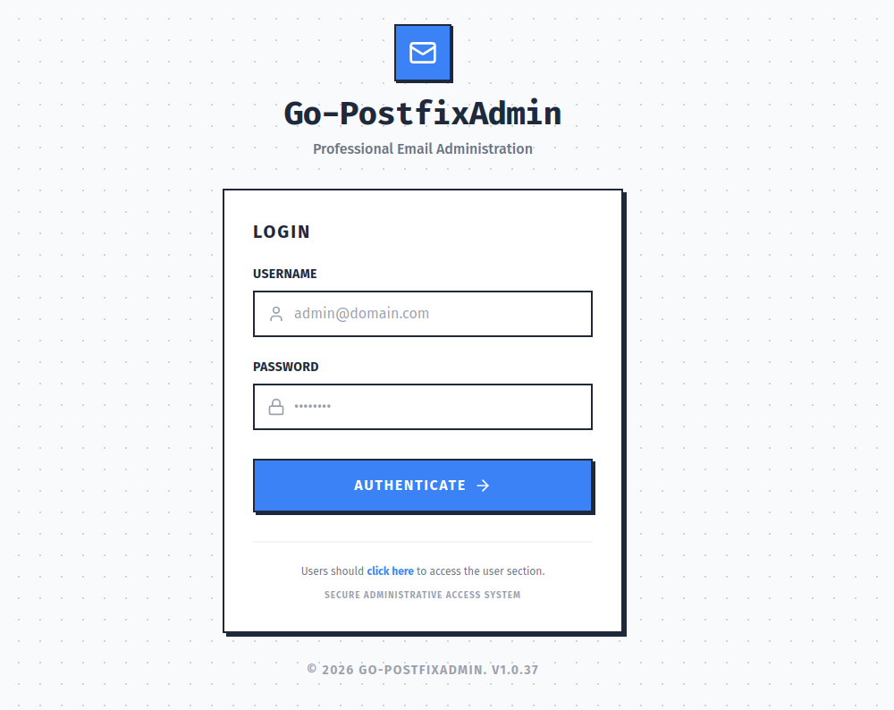

# Go-PostfixAdmin

Professional Email Administration System built with Go, Echo, and Tailwind CSS.

## What This Document Covers

This is the main entry point for the project documentation. It covers the product overview, build options, runtime basics, and links to the detailed guides.

## Overview

Go-PostfixAdmin provides a web UI and CLI for managing domains, mailboxes, aliases, admins, vacation rules, and operational mail logs in Postfix/Dovecot environments.

For the full feature list and capability breakdown, see [FEATURES.md](FEATURES.md).

## Documentation

- [Features](FEATURES.md)
- [Development guide](DEVELOPMENT.md)
- [Quick mail server setup](SETUP_MAILSERVER.md)
- [Complete setup guide](DOCUMENTS/setup/README.md)
- [Contributing](CONTRIBUTING.md)

---

## 🚀 Execution

After building, you can run the binary directly:

```bash
./postfixadmin server --port=8080
```

Or via Docker:

```bash
docker run -p 8080:8080 -e DB_URL="your-dsn" postfixadmin:latest
```

### Deployment with Systemd (Linux)

To deploy the application natively on a Linux server, you can use the included Systemd service file.

The pre-configured file is located at `DOCUMENTS/setup/postfixadmin.service`. It expects the application to be placed in the `/opt/go-postfixadmin` directory and will read environment variables from a `config.toml` file in this same directory.

**Service Installation:**

```bash
# 1. Copy the file to the systemd services directory
sudo cp DOCUMENTS/setup/postfixadmin.service /etc/systemd/system/

# 2. Reload systemd configurations
sudo systemctl daemon-reload

# 3. Enable the service to run on boot
sudo systemctl enable postfixadmin.service

# 4. Start the service
sudo systemctl start postfixadmin.service

# 5. Monitor logs in real-time
# The service directs output to the postfixadmin.log file
tail -f /opt/go-postfixadmin/postfixadmin.log
```

---
## 📸 Screenshots



Check out more images in the [screenshots](DOCUMENTS/screenshots) folder.

---

## 📖 Installation and Configuration Guide

For complete step-by-step instructions on how to set up an email server on Ubuntu with Postfix, Dovecot, MariaDB, and integrate it with Go-PostfixAdmin, see our [Complete Setup Guide](DOCUMENTS/setup/README.md).

You can also find our guide for setting up a complete webmail environment with [Nginx, SOGo, and MariaDB here](DOCUMENTS/setup/nginx-sogo-mysql.md).
