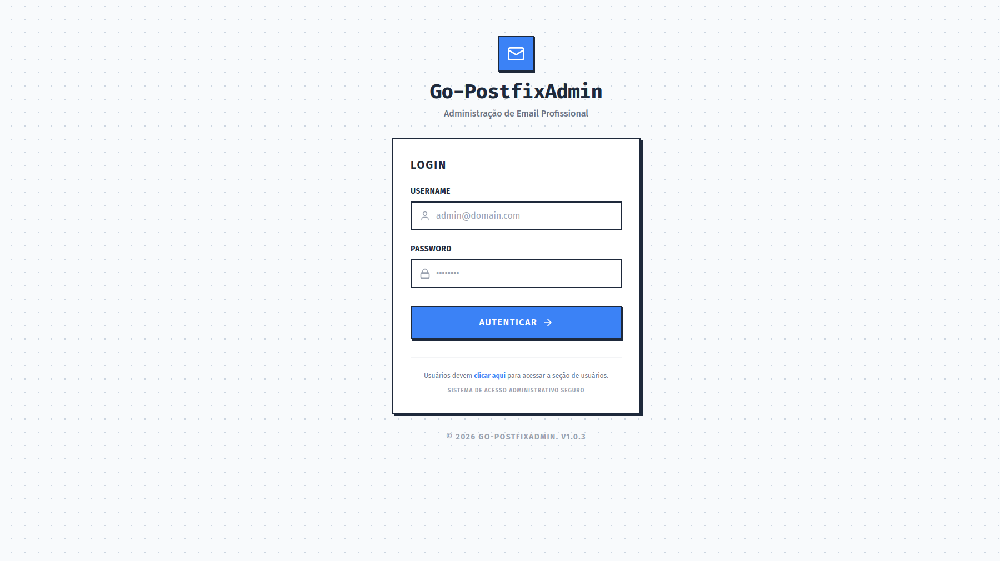
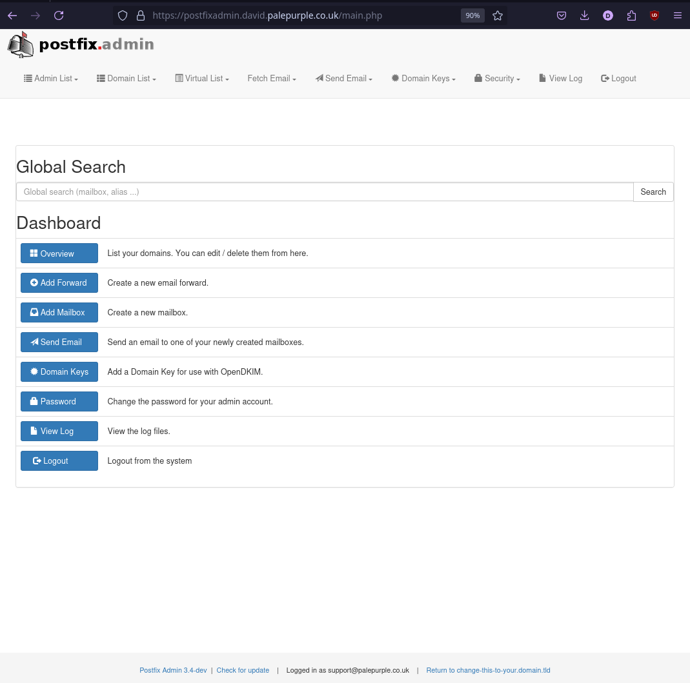
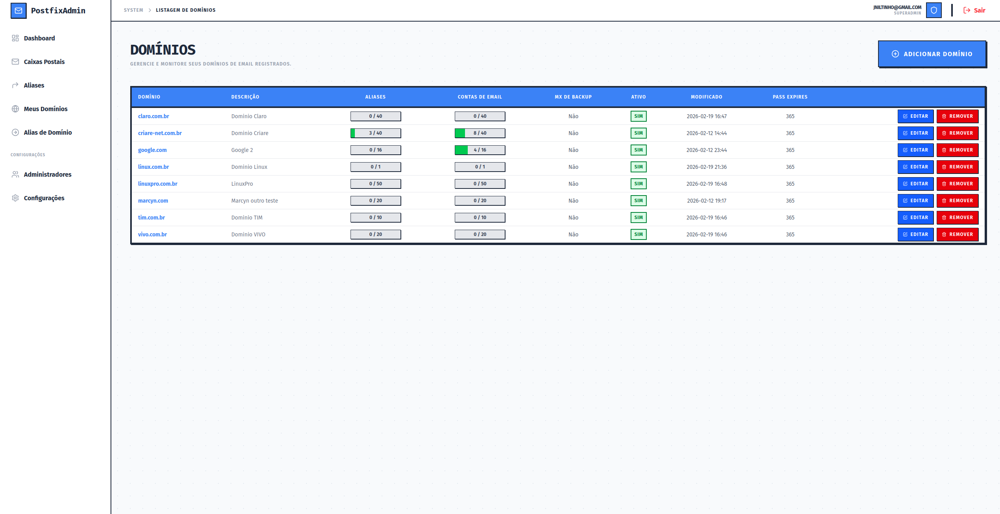
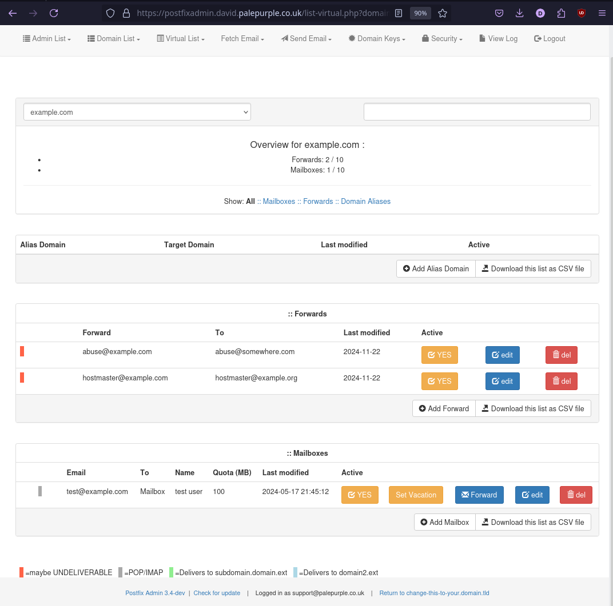
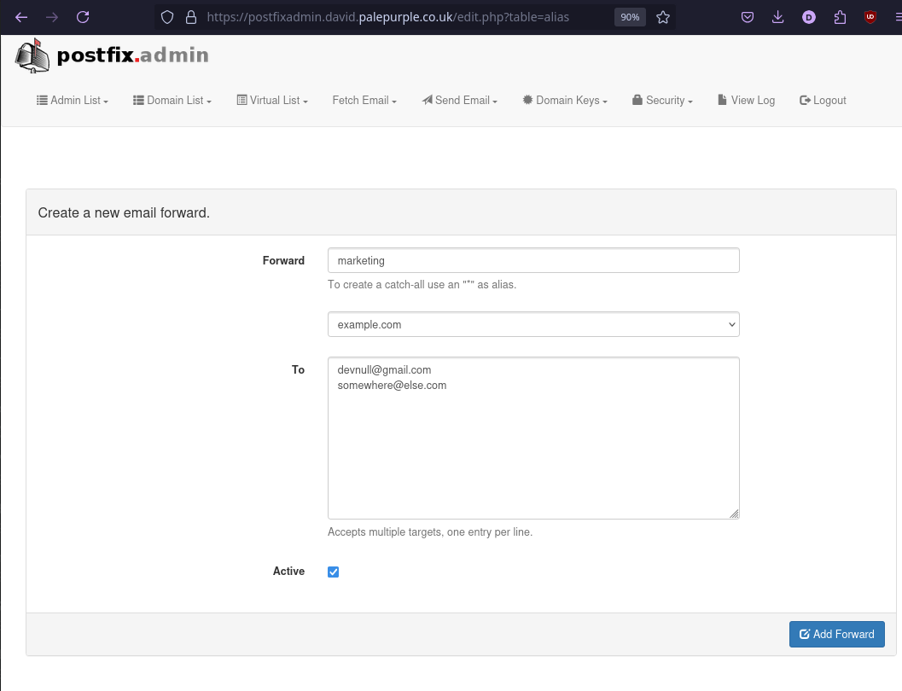
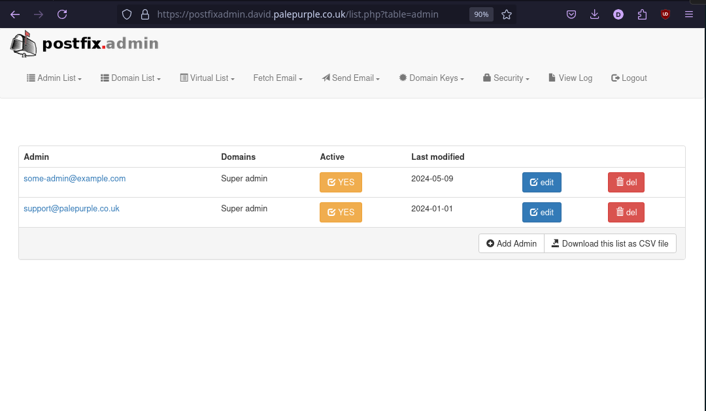
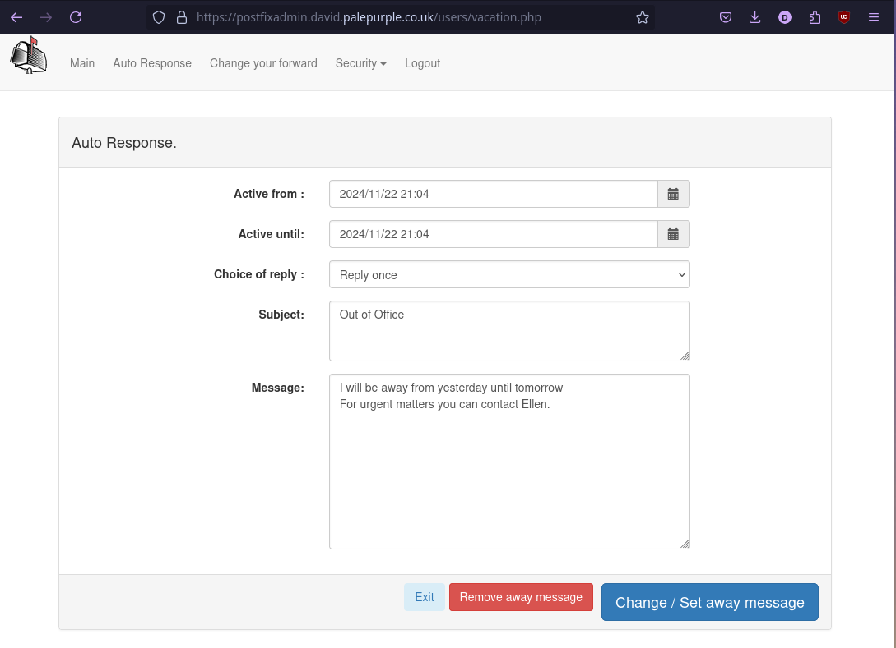
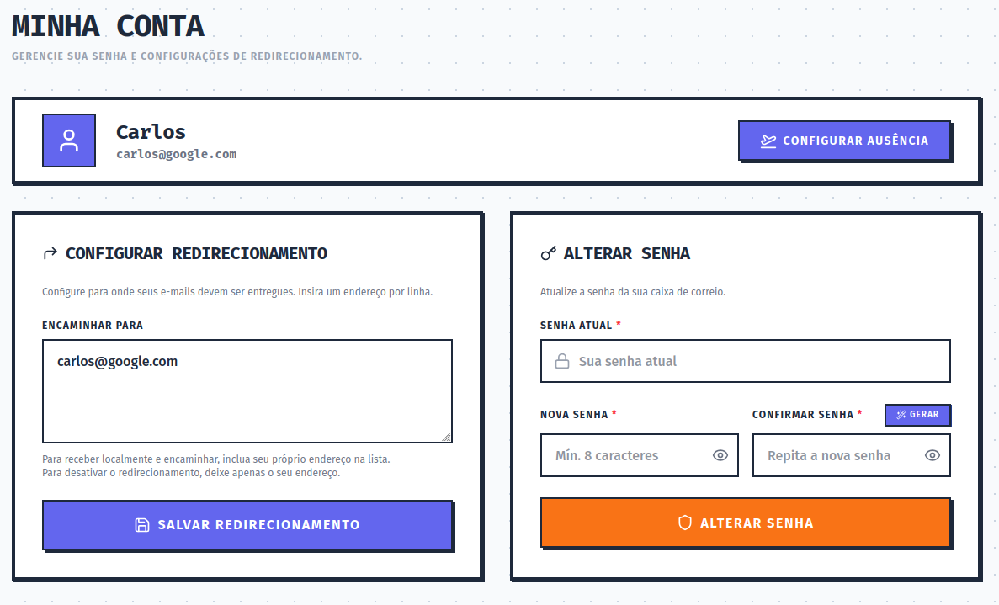

# Go-PostfixAdmin

[](https://go.dev/)
[](./LICENSE)
[](https://github.com/jniltinho/go-postfixadmin/releases)
[](https://github.com/jniltinho/go-postfixadmin/stargazers)
[](https://hub.docker.com/r/jniltinho/go-postfixadmin)

**Modern, self-contained web UI and REST API for Postfix + Dovecot mail servers.**

A single Go binary with the entire Vue 3 frontend embedded. Manage domains, mailboxes, aliases, admins, user self-service (passwords, forwards, vacation), audit logs, and Postfix transports — with JWT auth, RBAC, and first-class CLI tools.

## Quick Start

### Build & run locally

```bash
git clone https://github.com/jniltinho/go-postfixadmin.git
cd go-postfixadmin

make build                 # builds Vue 3 frontend + embeds into Go binary
./bin/postfixadmin --generate-config

# Prepare your database first (see setup guides below)
./bin/postfixadmin migrate
./bin/postfixadmin migrate rbac   # for RBAC roles/permissions

./bin/postfixadmin server
```

The admin UI is at `http://localhost:8080`.

Swagger UI (when `server.swagger_enable = true`): `http://localhost:8080/swagger/`.

### Docker

```bash
make build-docker

docker run -p 8080:8080 \
  -e DB_URL="postfix:pass@tcp(your-db:3306)/postfix?charset=utf8mb4&parseTime=True" \
  jniltinho/go-postfixadmin:latest
```

For a ready-to-use stack with MariaDB + auto admin creation, use the included [docker-compose.yml](docker-compose.yml).

Pre-built binaries, .deb and .rpm packages are published on every release: [GitHub Releases](https://github.com/jniltinho/go-postfixadmin/releases).

## Screenshots

| Login | Dashboard |
|-------|-----------|
|  |  |

| Domains | Mailboxes & Forwards |
|---------|----------------------|
|  |  |

| Create Alias | Admins |
|--------------|--------|
|  |  |

| User Portal – Vacation | User Portal – Forwarding |
|------------------------|------------------------|
|  |  |

More screenshots in [DOCUMENTS/screenshots](DOCUMENTS/screenshots).

## Key Features

- **Embedded SPA** — Vue 3 + Tailwind v4 frontend compiled into the Go binary (single deployable artifact, no CDN or separate static hosting)
- **Full mail management** — domains, mailboxes (with quota), aliases, alias domains, transports
- **User self-service portal** — end users manage their own password, forwarding and vacation auto-reply (Dovecot Sieve)
- **Production API** — versioned REST API (`/api/v1`) with JWT (short-lived access + httpOnly refresh), persistent API keys, and interactive Swagger docs
- **RBAC** — superadmin vs domain-admin separation + fine-grained permissions
- **CLI & automation** — CSV import/export, bulk mailbox creation, backup helper, quota reports, log viewers, `transport server` for Postfix `transport_maps`
- **Observability** — admin action logs + mail log ingestion (`readlog`)
- **i18n** — English, Português (pt_BR), Español — fully translated UI and messages
- **Dual database** — MariaDB/MySQL and PostgreSQL (GORM)

Complete capability list: [FEATURES.md](FEATURES.md)

## Documentation

- [Features](FEATURES.md)
- [Development Guide](DEVELOPMENT.md)
- [Quick Setup – MariaDB](DOCUMENTS/setup/SETUP_MAILSERVER_MARIADB.md)
- [Quick Setup – PostgreSQL](DOCUMENTS/setup/SETUP_MAILSERVER_POSTGRESQL.md)
- [Complete Setup Guide](DOCUMENTS/setup/README.md)
- [Transport TCP Server](DOCUMENTS/setup/SETUP_TRANSPORT.md)
- [Contributing](CONTRIBUTING.md)

## Tech Stack

**Backend**: Go 1.26, Echo v5, GORM, Cobra, Viper, Zerolog, Swaggo (OpenAPI)

**Frontend (embedded)**: Vue 3 + TS + Vite, Pinia, Vue Router, Tailwind CSS v4, Lucide icons

**Packaging**: Multi-stage Docker, UPX-compressed binary, native .deb/.rpm via Makefile + GitHub Actions

## Contributing

Contributions are welcome. Please read [CONTRIBUTING.md](CONTRIBUTING.md) first.

## License

This project is licensed under the MIT License — see the [LICENSE](LICENSE) file for details.
