# Go-PostfixAdmin

[](https://go.dev/)
[](./LICENSE)
[](https://github.com/jniltinho/go-postfixadmin/releases)
[](https://github.com/jniltinho/go-postfixadmin/releases)
[](https://github.com/jniltinho/go-postfixadmin/actions/workflows/release.yml)
[](https://github.com/jniltinho/go-postfixadmin/pkgs/container/go-postfixadmin)
[](https://github.com/jniltinho/go-postfixadmin/stargazers)

<p align="center">
  
</p>

<p align="center">
  <b>A modern, single-binary web panel and REST API for Postfix + Dovecot mail servers.</b><br>
  Domains, mailboxes, aliases, admins, RBAC and a self-service user portal — no PHP, no web server, no extra runtime.
</p>

<p align="center">
  <b><a href="https://github.com/jniltinho/go-postfixadmin/releases/latest">⬇ Download the latest release</a></b>
</p>

<p align="center">
  <a href="#-quick-start">Quick Start</a> ·
  <a href="#-screenshots">Screenshots</a> ·
  <a href="#-themes-and-settings">Themes</a> ·
  <a href="#-features">Features</a> ·
  <a href="FEATURES.md">Full feature list</a> ·
  <a href="DOCUMENTS/setup/README.md">Setup guide</a>
</p>

---

## ✨ Why Go-PostfixAdmin?

- **One file to deploy** — the Vue 3 UI, Swagger docs and translations are embedded in a single static Go binary. Copy it, point it at your database, run it. Also shipped as Docker image, `.deb` and `.rpm`.
- **Fast and lightweight** — no PHP-FPM, Apache/Nginx or Node runtime in production — just one Go process.
- **API-first** — every action in the UI is available through a documented REST API (`/api/v1`) with JWT and long-lived API keys, ready for automation and provisioning scripts.
- **Built for teams** — superadmins, domain admins and fine-grained RBAC roles decide who can see and change what.
- **Users help themselves** — a separate portal lets mailbox owners change their password, set forwarding and configure vacation auto-replies.
- **Familiar data model** — PostfixAdmin-style tables (`domain`, `mailbox`, `alias`, …) and `$2y$` bcrypt hashes, on MariaDB/MySQL or PostgreSQL.
- **Your look, any screen** — 20 themes (Windows XP included) picked in Settings, and a layout that scales from 1366×768 to FullHD, QHD and 4K.
- **Ops from the panel** — Postfix/Dovecot service status and an opt-in web SSH terminal (`xterm-256color`) in Settings.
- **Scriptable CLI** — bulk CSV import/export, domain/mailbox/transport management, MySQL backups, quota reports and a Postfix `transport_maps` TCP server.

## 🚀 Quick Start

### Docker Compose (fastest)

```bash
git clone https://github.com/jniltinho/go-postfixadmin.git
cd go-postfixadmin
docker compose up -d
```

Open `http://localhost:8080` — the stack pulls the published image, includes MariaDB and creates the first admin automatically (`admin@example.com` / `adminpassword` — change it in [docker-compose.yml](docker-compose.yml)).

### Docker (GitHub Packages)

Multi-arch images (`linux/amd64`, `linux/arm64`) are published to [GitHub Packages](https://github.com/jniltinho/go-postfixadmin/pkgs/container/go-postfixadmin) for every release: `latest`, `X.Y.Z` and `X.Y`.

```bash
docker pull ghcr.io/jniltinho/go-postfixadmin:latest
docker run -p 8080:8080 \
  -e DB_URL="postfix:pass@tcp(your-db:3306)/postfix?charset=utf8mb4&parseTime=True" \
  ghcr.io/jniltinho/go-postfixadmin:latest
```

### Binary / .deb / .rpm

Download from [GitHub Releases](https://github.com/jniltinho/go-postfixadmin/releases), then:

```bash
./postfixadmin --generate-config      # writes config.toml — set your database
./postfixadmin migrate                # create / update the schema
./postfixadmin migrate rbac           # optional: RBAC roles and permissions
./postfixadmin admin --add-superadmin admin@example.com:'S3cure!Pass'
./postfixadmin server                 # http://localhost:8080
```

Swagger UI is available at `/swagger/` when `server.swagger_enable = true`.

### Build from source

```bash
make build        # builds the Vue 3 frontend and embeds it into bin/postfixadmin
make run
```

See [DEVELOPMENT.md](DEVELOPMENT.md) for the full developer workflow.

## 📸 Screenshots

### Administration

| Domains | Email accounts |
|---------|----------------|
|  |  |

| Add email account | Add domain |
|-------------------|------------|
| 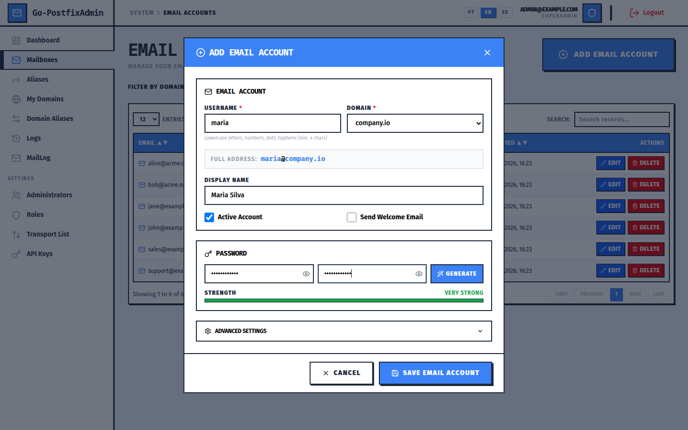 | 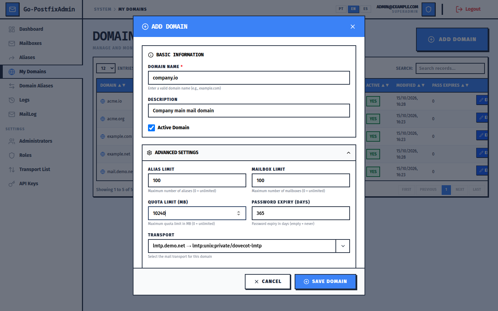 |

| Aliases | Domain aliases |
|---------|----------------|
| 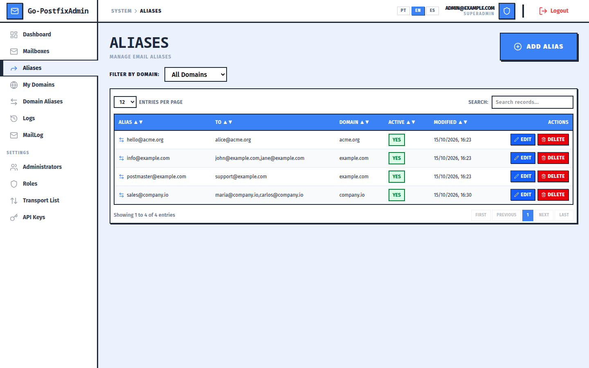 | 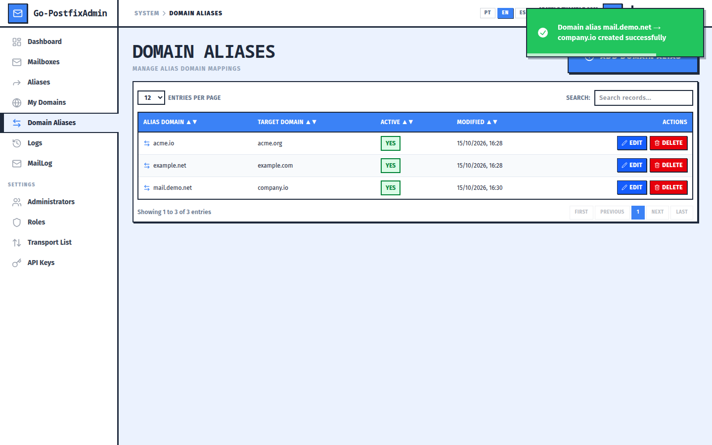 |

| Administrators | RBAC roles |
|----------------|------------|
| 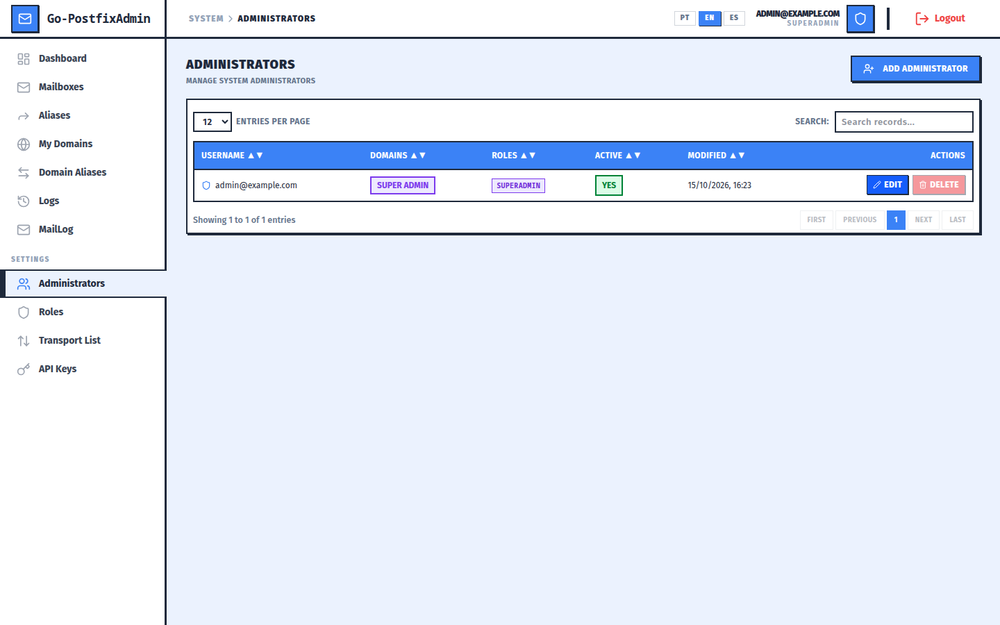 | 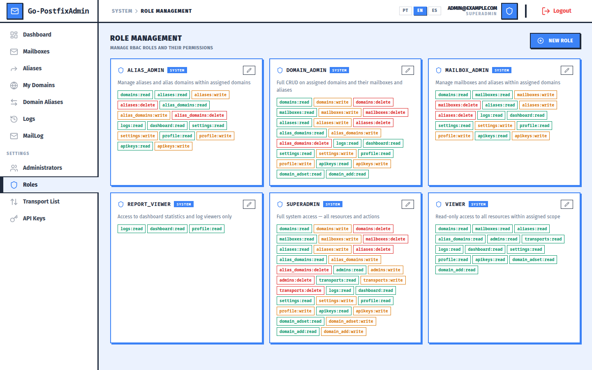 |

| Mail delivery log | Audit log |
|-------------------|-----------|
| 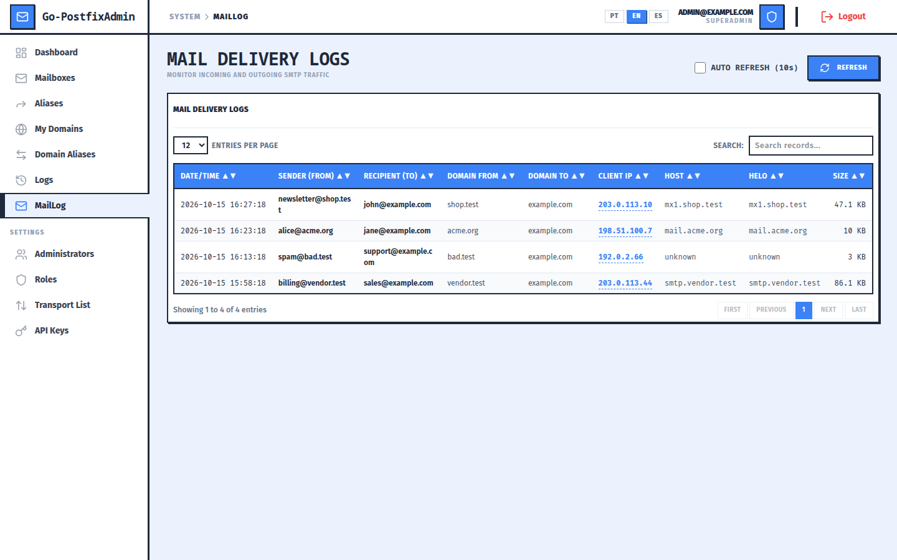 | 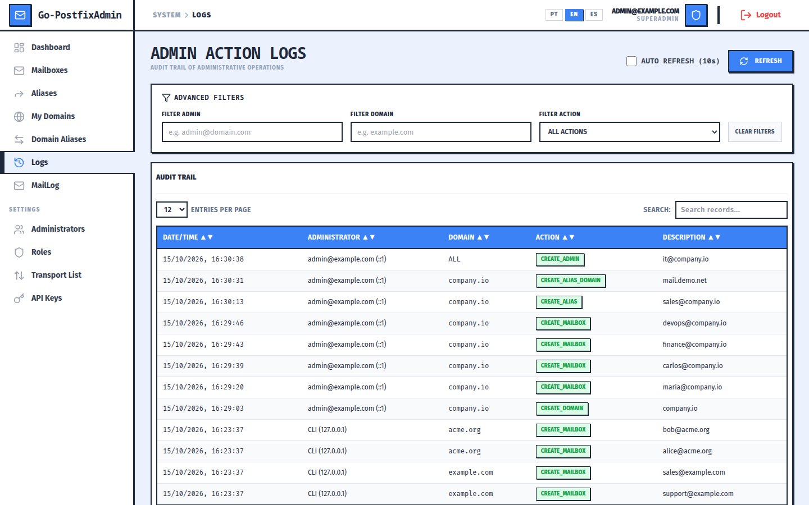 |

### User self-service portal

| Forwarding & password | Vacation auto-reply |
|-----------------------|---------------------|
|  | 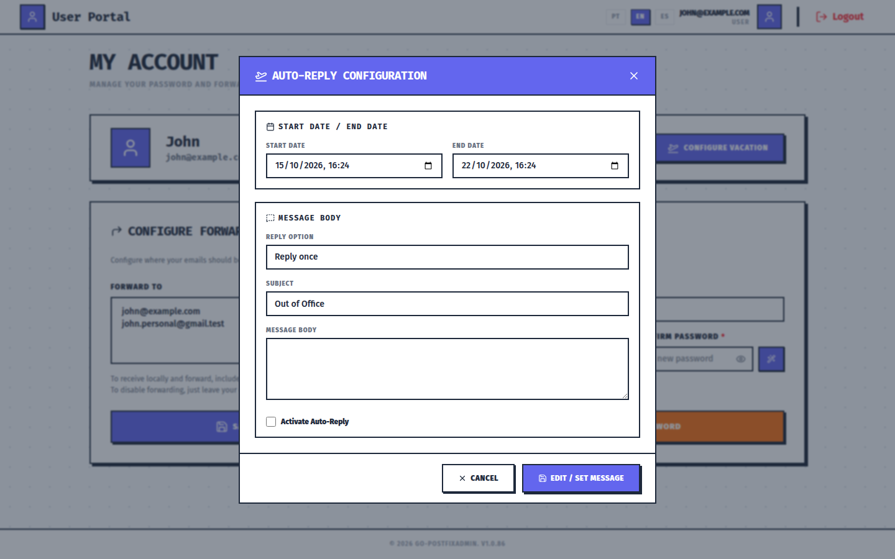 |

### REST API


## 🎨 Themes and Settings

**Settings › Appearance** — 20 themes with live previews, saved per browser; `[ui] default_theme` sets the default. Default (neo-brutalist), ADManager, Breeze, Violet, Aurora and Crystal (light and dark), Cone, **Windows XP**, Windows 98, Graphite, Grafana, RabbitMQ, Matrix, Winamp, Pink Panther and High contrast — ported from [ad-manager](https://github.com/jniltinho/ad-manager).

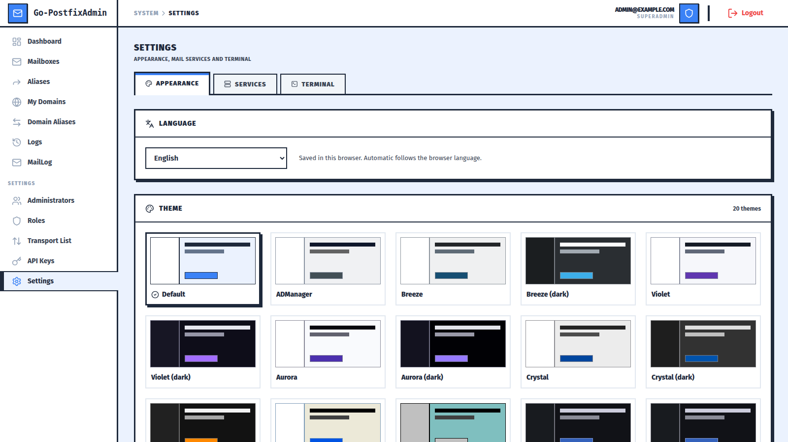

| Windows XP | Matrix | Breeze (dark) |
|------------|--------|---------------|
| 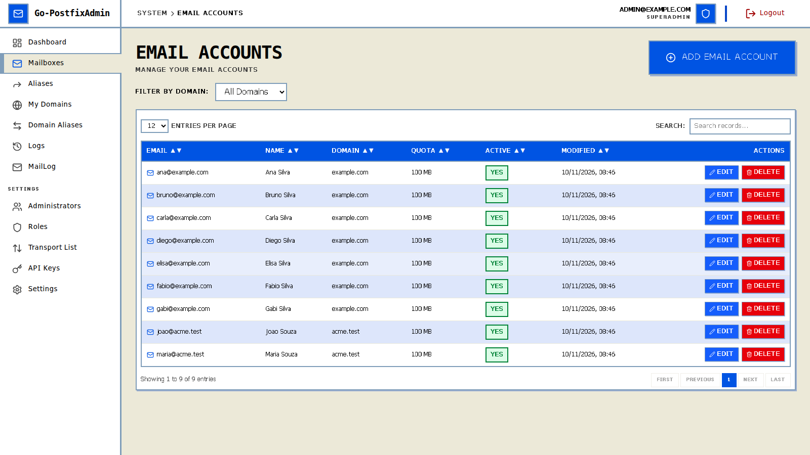 | 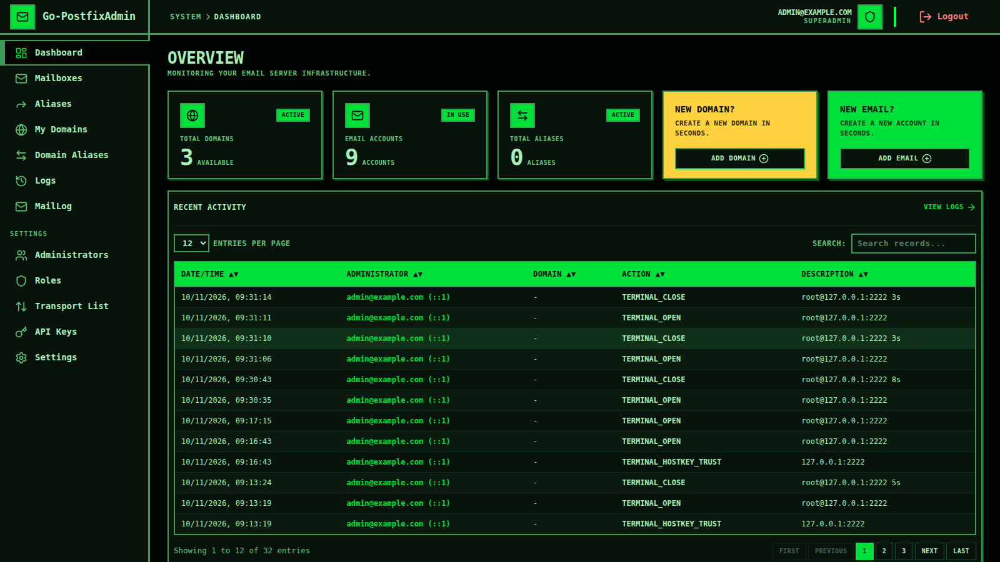 | 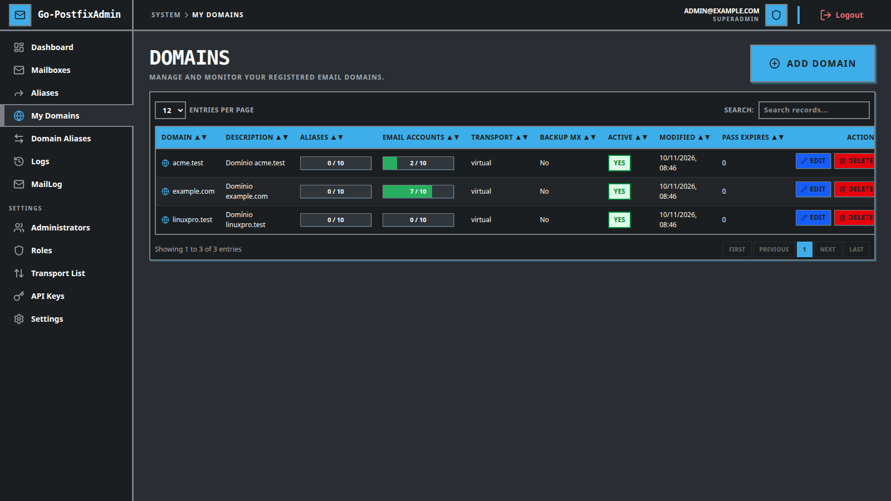 |

**Settings › Configuration** edits a few operational `config.toml` keys from the panel (critical ones stay read-only, secrets are never shown). **Settings › Services** shows `postfix.service`, `dovecot.service` and `rspamd.service` from systemd. **Settings › Terminal** is an opt-in web SSH terminal (xterm.js, `xterm-256color`, 256 colors) for superadmins: credentials are never stored, the host key is pinned after you confirm its fingerprint, and opening/closing is audited. Enable it with `[terminal] enabled = true` — see the [setup guide](DOCUMENTS/setup/README.md#31-appearance-service-status-and-web-terminal-settings).

| Services | Terminal |
|----------|----------|
| 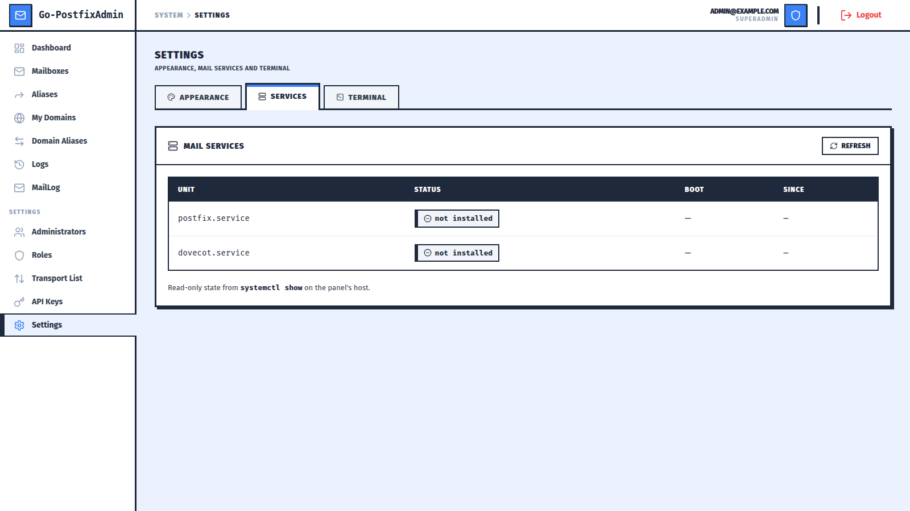 |  |

The whole UI is sized in `rem` on a root font that grows with the screen (16px on FullHD, ~19px on QHD, 24px on 4K), and Settings meets WCAG AAA text contrast.

More screenshots (login pages, transports, API keys, create admin/alias…) in [DOCUMENTS/screenshots](DOCUMENTS/screenshots).

## 🧩 Features

- **Mail management** — domains (limits, quotas, backup MX), mailboxes with quota, aliases with multiple recipients, alias domains, per-domain Postfix transports
- **User portal** — password change, forwarding, vacation auto-reply via Dovecot Sieve
- **Security** — JWT (short-lived access token + httpOnly refresh cookie), CSRF origin check, login rate limiting, strong password policy with built-in generator, persistent API keys with expiry
- **Access control** — superadmin / domain-admin separation plus optional fine-grained RBAC roles
- **Operations** — admin audit log, mail delivery log ingestion (`readlog`), quota reports, MySQL/MariaDB backups, optional OpenTelemetry export to OpenObserve
- **Themes & layout** — 20 themes incl. Windows XP, FullHD/QHD/4K scaling, AAA contrast in Settings
- **Settings** — Postfix/Dovecot/Rspamd status, opt-in web SSH terminal with pinned host key
- **i18n** — English, Português (pt_BR) and Español; detected from the browser, changeable in Settings
- **Databases** — MariaDB/MySQL and PostgreSQL

Complete capability list: [FEATURES.md](FEATURES.md)

## Documentation

- [Features](FEATURES.md)
- [Development Guide](DEVELOPMENT.md)
- [Quick Setup – MariaDB](DOCUMENTS/setup/SETUP_MAILSERVER_MARIADB.md)
- [Quick Setup – PostgreSQL](DOCUMENTS/setup/SETUP_MAILSERVER_POSTGRESQL.md)
- [Complete Setup Guide](DOCUMENTS/setup/README.md)
- [Transport TCP Server](DOCUMENTS/setup/SETUP_TRANSPORT.md)
- [Contributing](CONTRIBUTING.md)

## Tech Stack

**Backend**: Go 1.27, Echo v5.4, GORM, Cobra, Viper, log/slog, Swaggo (OpenAPI), x/crypto/ssh

**Frontend (embedded)**: Vue 3 + TS + [Vite+](https://viteplus.dev) (`vp`), Pinia, Vue Router, Tailwind CSS v4, Lucide icons, xterm.js

**Packaging**: Multi-stage multi-arch Docker image on GitHub Packages (`ghcr.io/jniltinho/go-postfixadmin`), UPX-compressed binary, native .deb/.rpm via Makefile + GitHub Actions

## Contributing

If Go-PostfixAdmin is useful to you, please ⭐ the repository — it helps other admins find it.


Contributions are welcome. Please read [CONTRIBUTING.md](CONTRIBUTING.md) first.

## License

Go-PostfixAdmin is an independent project, inspired by and not affiliated with [PostfixAdmin](https://github.com/postfixadmin/postfixadmin).


This project is licensed under the MIT License — see the [LICENSE](LICENSE) file for details.

## OpenTelemetry / OpenObserve

Optional application log, HTTP/database trace and metric export to OpenObserve is available. All export and database tracing switches default to disabled. See [configuration and deployment](DOCUMENTS/setup/OBSERVABILITY.md) and [isolated Docker validation](tests/observability/README.md).

Set the OpenObserve authorization header using your ingestion email/password (the credentials below are fictional):

```bash
# Fictional credentials: replace with your OpenObserve ingestion credentials.
export OBSERVABILITY_AUTHORIZATION="Basic $(printf '%s' 'telemetry@example.com:example-password' | base64 | tr -d '\r\n')"
```

Then enable the desired signals and set their endpoints as described in the configuration guide. For Docker, pass this variable into the app service and recreate the container.
